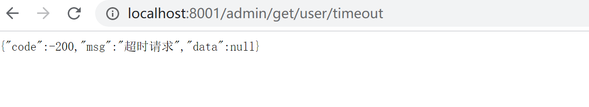
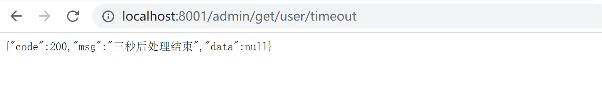
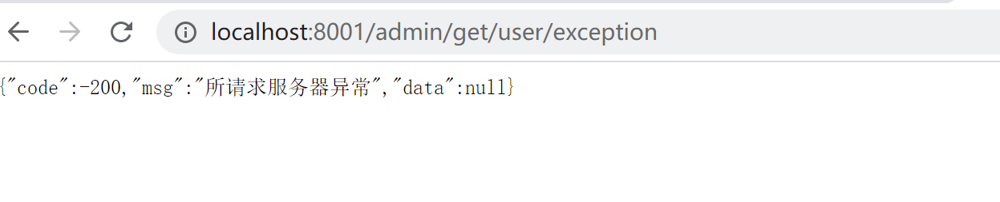
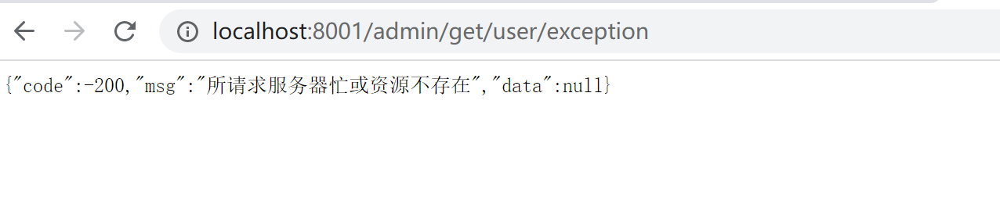

##### Hystrix
&#160; &#160; &#160; &#160;分布式系统中调用服务会遇到的问题，当调用链路过长，某个环节请求出现超时、异常、服务宕机时，会引起整个调用链路出错或者严重占用资源，并且可能蔓延至整个系统，从而引起雪崩效应。
&#160; &#160; &#160; &#160;Hystrix是一个用于处理用于处理分布式系统的延迟和容错的开源框架，当遇到服务调用超时、异常、服务宕机等时，Hystrix能保证向调用方返回一个符合预期的、可处理的备选响应（FallBack），而不是长时间的等待或者抛出调用方法无法处理的异常，这样就保证了服务调用方的线程不会被长时间不必要的占用，降低服务器性能，或导致整体服务失败，可以提高分布式系统的弹性。

<h5>使用Hystrix</h5>

<h5>服务降级FallBack</h5>

&#160; &#160; &#160; &#160;服务降级是当服务器压力剧增的情况下，根据当前业务情况及流量对一些服务和页面有策略的降级，以此释放服务器资源以保证核心任务的正常运行。Hystrix服务降级是针对处理超时或异常的请求做出快速的、可处理响应。如给出友好的提示或返回默认的结果。

服务降级发生场景
 - 程序运行异常
 - 处理超时
 - tomcat或其他服务器容器线程池/信号量打满也会导致服务降级
 - 服务熔断触发服务降级

<h6>通过定义FallBack方法使用服务降级</h6>
      
<p>在服务提供方进行服务降级</p>

`opm.xml`
```
...
<!-- hystrix -->
        <dependency>
            <groupId>org.springframework.cloud</groupId>
            <artifactId>spring-cloud-starter-netflix-hystrix</artifactId>
        </dependency>
...
```
需要作服务降级的请求
`UserController.java`
```
/**
 * @author :jty
 * @date :20-7-20
 * @description :用户模块
 */
@RestController
public class UserController {

    Logger logger = LoggerFactory.getLogger(UserController.class);

    /**
     * OpenFeign 超市请求测试,1.5s超时,自定义处理超时参数
     */
    @GetMapping(value = "/get/user/timeout")
    @HystrixCommand(fallbackMethod = "userServiceTimeOutFb",
            commandProperties = {
                    @HystrixProperty(name = "execution.isolation.thread.timeoutInMilliseconds", value = "4000")
            })
    public Result userServiceTimeOut() {
        try {
            TimeUnit.MILLISECONDS.sleep(3000);
        } catch (InterruptedException e) {
            logger.info(e.getMessage());
        }
        return new Result(200, "三秒后处理结束");
    }

    /**
     * 备选响应
     */
    public Result userServiceTimeOutFb() {
        return new Result(-200, "超时请求");
    }

    /**
     * 模拟程序异常
     */
    @GetMapping(value = "/get/user/exception")
    public Result userServiceHappenException() {
        int a = 10 / 0;
        return new Result(200, "程序处理异常");
    }
}
```
`UserApp.java`
```
/**
 * @author :jty
 * @date :20-7-20
 * @description :用户模块   @EnableEurekaClient eureka客户端 @EnableDiscoveryClient开启服务发现，获取服务信息
 *               @EnableCircuitBreaker  开启Hystrix 服务降级熔断
 */
@SpringBootApplication
@EnableEurekaClient
@EnableDiscoveryClient
@EnableCircuitBreaker
public class UserApp {
    public static void main(String[] args) {
        new SpringApplicationBuilder(UserApp.class).web(WebApplicationType.SERVLET).run(args);
    }
}
```

<p>通过服务消费方调用测试</p>


将服务降级超时参数改为4000 ,`@HystrixProperty(name = "execution.isolation.thread.interruptOnTimeout",value = "4000")`

`@HystrixProperty(name = "execution.isolation.thread.interruptOnTimeout",value = "4000")`可配置参数有默认值，在
`com/netflix/hystrix/hystrix-core/1.5.18/hystrix-core-1.5.18.jar!/com/netflix/hystrix/HystrixCommandProperties.class`中可查看相应参数。


<p>在服务消费方作服务降级</p>

`pom.xml`
```
...
 <dependency>
            <groupId>org.springframework.cloud</groupId>
            <artifactId>spring-cloud-starter-netflix-hystrix</artifactId>
        </dependency>
...
```
`AdminController.java`
```
/**
 * @author :jty
 * @date :20-7-28
 * @description : 管理员模块
 */
@RestController
public class AdminController {
    @Autowired
    UserFeignService userFeignService;
    /**
     * OpenFeign 超时请求测试
     */
    @GetMapping(value = "/admin/get/user/timeout")
    public Result userServiceTimeOut(){
        Result result = userFeignService.userServiceTimeOut();
        return result;
    }
    /**
     * OpenFeign 模拟请求目的服务器程序异常
     */
    @GetMapping(value = "/admin/get/user/exception")
    @HystrixCommand(fallbackMethod = "userServiceExceptionFb")
    public Result userServiceException(){
        Result result = userFeignService.userServiceTimeOut();
        return result;
    }
    /** 备选响应 */
    public Result userServiceExceptionFb(){
        return new Result(-200,"所请求服务器异常");
    }
```
`UserFeignService.java`
```
/**
 * @author :jty
 * @date :20-8-1
 * @description : feign 服务调用接口 @FeignClient(value = "user-server")  value 为目标服务名
 * 方法需要与UserController定义请求方法一致，即UserController请求接口方法中有的SpringMVC注解，本接口一定要有。
 */
@Component
@FeignClient(value = "user-server")
public interface UserFeignService {
    /**
     * OpenFeign 超时请求测试
     * @return Result
     */
    @GetMapping(value = "/get/user/timeout")
    Result userServiceTimeOut();

    /**
     * 模拟程序异常
     * @return Result
     */
    @GetMapping(value = "/get/user/exception")
    Result userServiceHappenException();
}
```
`AdminApp.java`
```
/**
 * @author :jty
 * @date :20-7-28
 * @description : @EnableFeignClients 开启feign服务调用，默认轮询负载均衡
 *                @EnableCircuitBreaker  开启Hystrix 服务降级熔断(断路器)
 */
@SpringBootApplication
@EnableEurekaClient
@EnableFeignClients
@EnableCircuitBreaker
public class AdminApp {
    public static void main(String[] args) {
        SpringApplication.run(AdminApp.class);
    }
}
```
返回结果并不是UserController中的结果



对于不需要自定义服务降级方法的请求，可以统一定义一个全局服务降级方法，只需在需要进行服务降级的controller方法上使用`@HystrixCommand`,在Controller类上使用`@DefaultProperties(defaultFallback = "userServiceGlobalFb")`指定全局服务降级方法。如修改上述请求异常方法。
```
/**
 * @author :jty
 * @date :20-7-28
 * @description : 管理员模块
 */
@RestController
@DefaultProperties(defaultFallback = "userServiceGlobalFb")
public class AdminController {
    @Autowired
    UserFeignService userFeignService;

    /**
     * OpenFeign 超时请求测试
     */
    @GetMapping(value = "/admin/get/user/timeout")
    public Result userServiceTimeOut(){
        Result result = userFeignService.userServiceTimeOut();
        return result;
    }
    /**
     * OpenFeign 模拟请求目的服务器程序异常
     * 注释@HystrixCommand(fallbackMethod = "userServiceExceptionFb") 测试全局服务降级方法
     */
    @GetMapping(value = "/admin/get/user/exception")
    //@HystrixCommand(fallbackMethod = "userServiceExceptionFb")
    @HystrixCommand
    public Result userServiceException(){
        Result result = userFeignService.userServiceTimeOut();
        return result;
    }
    /** 备选响应 */
    public Result userServiceExceptionFb(){
        return new Result(-200,"所请求服务器异常");
    }
    /** 全局备选响应 */
    public Result userServiceGlobalFb(){
        return new Result(-200,"所请求服务器忙或资源不存在");
    }
}
```




<p>上述方式缺点 代码膨胀：每有一个地方调用请求就要编写相应的服务降级方法；代码高耦合：系统代码跟业务代码写在一起。</p>