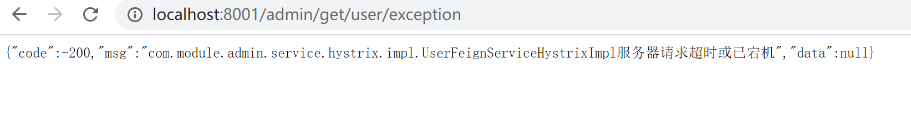

##### Hystrix
&#160; &#160; &#160; &#160;分布式系统中调用服务会遇到的问题，当调用链路过长，某个环节请求出现超时、异常、服务宕机时，会引起整个调用链路出错或者严重占用资源，并且可能蔓延至整个系统，从而引起雪崩效应。
&#160; &#160; &#160; &#160;Hystrix是一个用于处理用于处理分布式系统的延迟和容错的开源框架，当遇到服务调用超时、异常、服务宕机等时，Hystrix能保证向调用方返回一个符合预期的、可处理的备选响应（FallBack），而不是长时间的等待或者抛出调用方法无法处理的异常，这样就保证了服务调用方的线程不会被长时间不必要的占用，降低服务器性能，或导致整体服务失败，可以提高分布式系统的弹性。

<h5>使用Hystrix</h5>

<h5>服务降级FallBack</h5>

&#160; &#160; &#160; &#160;服务降级是当服务器压力剧增的情况下，根据当前业务情况及流量对一些服务和页面有策略的降级，以此释放服务器资源以保证核心任务的正常运行。Hystrix服务降级是针对处理超时或异常的请求做出快速的、可处理响应。如给出友好的提示或返回默认的结果。

服务降级发生场景
 - 程序运行异常
 - 处理超时
 - tomcat或其他服务器容器线程池/信号量打满也会导致服务降级
 - 服务熔断触发服务降级
 
 <h6>通过实现feign 服务调用接口使用Hystrix</h6>
 
 `pom.xml`
 ```
 ...
        <dependency>
             <groupId>org.springframework.cloud</groupId>
             <artifactId>spring-cloud-starter-netflix-hystrix</artifactId>
         </dependency>
 ...
 ```
 
 `application.yml`
 ```
 ...
 #开启feign hystrix 服务降级
 feign:
   hystrix:
     enabled: true
 ...
 ```
 
 `UserFeignService.java`
 ```
 /**
  * @author :jty
  * @date :20-8-1
  * @description : feign 服务调用接口 @FeignClient(value = "user-server")  value 为目标服务名
  * allback = UserFeignServiceHystrixImpl.class Hystrix服务降级方法的实现类
  * 方法需要与UserController定义请求方法一致，即UserController请求接口方法中有的SpringMVC注解，本接口一定要有。
  */
 @Component
 @FeignClient(value = "user-server",fallback = UserFeignServiceHystrixImpl.class)
 public interface UserFeignService {
     /**
      * OpenFeign 超时请求测试
      * @return Result
      */
     @GetMapping(value = "/get/user/timeout")
     Result userServiceTimeOut();
 
     /**
      * 模拟程序异常
      * @return Result
      */
     @GetMapping(value = "/get/user/exception")
     Result userServiceHappenException();
 }
 ```
 
 `UserFeignServiceHystrixImpl.java`
 ```
 /**
  * @author :jty
  * @date :20-8-2
  * @description : 通过实现feign接口使用Hystrix服务降级
  */
 @Component
 public class UserFeignServiceHystrixImpl implements UserFeignService {
     @Override
     public Result userServiceTimeOut() {
         return new Result(-200,UserFeignServiceHystrixImpl.class.getName()+"服务器请求超时或已宕机");
     }
 
     @Override
     public Result userServiceHappenException() {
         return new Result(-200,UserFeignServiceHystrixImpl.class.getName()+"服务器异常或已宕机");
     }
 }
 ```
 
 
 
 <p>优点：代码分离、高重用、可插拔。</p>