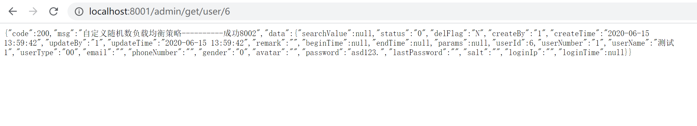
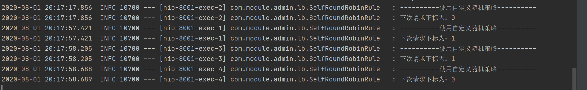
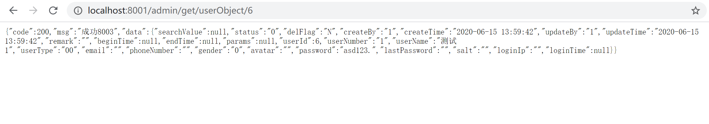
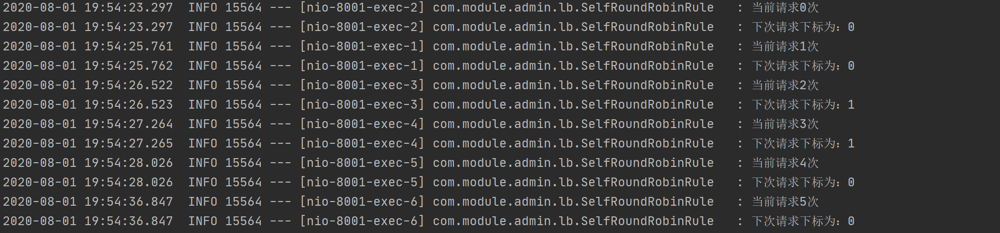

##### 负载均衡
负载均衡（Load Balance）其意思就是分摊到多个操作单元上进行执行，例如Web服务器、FTP服务器、企业关键应用服务器和其它关键任务服务器等，从而共同完成工作任务，简单地说就是将用户的请求平摊的分配到多个服务上，从而达到HA(高可用)；常见的负载均衡有软件Nginx、LVS,硬件F5等；

##### Ribbon
Ribbon是Netflix发布的云中间层服务开源项目，其主要功能是提供客户端实现负载均衡算法。Ribbon客户端组件提供一系列完善的配置项如连接超时，重试等。简单的说，Ribbon是一个客户端负载均衡器，我们可以在配置文件中Load Balancer后面的所有机器，Ribbon会自动的帮助你基于某种规则（如简单轮询，随机连接等）去连接这些机器，我们也很容易使用Ribbon实现自定义的负载均衡算法。

##### Ribbon客户端负载均衡 VS Nginx服务端负载均衡
&#160; &#160; &#160; &#160;Nginx是服务器端负载均衡（集中式LB），客户端所有请求都会交给Nginx,然后有Nginx实现转发请求。如客户端C1请求服务器S1,S1通过Nginx负载均衡转发请求至S2、S3，C1只知道请求的服务器为S1，但实际请求的是S2、S3,即负载均衡由服务端实现，客户端不知道具体细节。
&#160; &#160; &#160; &#160;Ribbon为客户端负载均衡(进程内LB)，服务消费者在调用服务提供者（集群）微服务接口时，会在注册中心上获取服务提供者注册信息服务列表之后缓存到JVM本地，通过某种负载均衡算法（如轮询）选择调用的服务的地址，从而在本地实现RPC远程调用技术。

##### Ribbon简单使用

Ribbon负载均衡：Ribbon+RestTemplate远程调用。

<h5>Eureka Client 服务消费者客户端<h5>

`pom.xml`
```
...
<!-- ribbon-->
        <dependency>
            <groupId>org.springframework.cloud</groupId>
            <artifactId>spring-cloud-starter-netflix-ribbon</artifactId>
        </dependency>
...
```
<p>spring-cloud-starter-netflix-eureka-client依赖中已经整合spring-cloud-starter-netflix-ribbon,pom中可不重新引入。</p>


`RestTemplateConfig.java`
```
/**
 * @author :jty
 * @date :20-7-28
 * @description :注入RestTemplate Bean
 */
@Configuration
public class RestTemplateConfig {
    /**
     * @LoadBalanced 通过服务名调用，开启Ribbon负载均衡,默认轮询
     * */
    @Bean
    @LoadBalanced
    public RestTemplate getRestTemplate(){
        return new RestTemplate();
    }
}
```

`AdminController.java`
```
/**
 * @author :jty
 * @date :20-7-28
 * @description : 管理员模块
 */
@RestController
public class AdminController {
    @Autowired
    RestTemplate restTemplate;
    /**通过服务名调用*/
    private static final String USER_MODULE_URL = "http://user-server";
    /** RestTemplate forObject */
    @GetMapping(value = "/admin/get/userObject/{userId}", produces = "application/json;charset=utf-8")
    public Result searchUser(@PathVariable int userId) {
        Result result = restTemplate.getForObject(USER_MODULE_URL + "/get/user/" + userId, Result.class);
        return result;
    }
    /** RestTemplate forEntity */
    @GetMapping(value = "/admin/get/userEntity/{userId}", produces = "application/json;charset=utf-8")
    public Result findUser(@PathVariable int userId) {
        ResponseEntity<Result> entity = restTemplate.getForEntity(USER_MODULE_URL + "/get/user/" + userId, Result.class);
        if(entity.getStatusCode().is2xxSuccessful()){
            return entity.getBody();
        }else{
            return new Result(-200,"请求失败！");
        }
    }
    @GetMapping(value = "/admin/post/create/user", produces = "application/json;charset=utf-8")
    public Result createUser(@RequestBody User user) {
        Result result = restTemplate.postForObject(USER_MODULE_URL + "/post/create/user", user, Result.class);
        return result;
    }
}
```
`UserController.java`
```
/**
 * @author :jty
 * @date :20-7-31
 * @description :用户模块
 */
@RestController
public class UserController {
    @Autowired
    private UserMapper userMapper;
    @Autowired
    private DiscoveryClient discoveryClient;
    @Value("${server.port}")
    String serverPort;
    Logger logger = LoggerFactory.getLogger(UserController.class);

    /**
     * 查询用户
     */
    @GetMapping(value = "/get/user/{userId}", produces = "application/json;charset=utf-8")
    public Result searchUser(@PathVariable(value = "userId") int userId) {
        User user = userMapper.getUserById(userId);
        if (user != null) {
            return new Result(200, "成功" + serverPort, user);
        }
        return new Result(-200, "无数据");
    }

    /**
     * 添加用户
     */
    @PostMapping(value = "/post/create/user", produces = "application/json;charset=utf-8")
    public Result createUser(@RequestBody User user) {
        int i = userMapper.createUser(user);
        if (i > 0) {
            return new Result(200, "成功" + serverPort, i);
        }
        return new Result(-200, "插入失败");
    }

    /**
     * 服务发现
     */
    @GetMapping(value = "/get/user/discovery")
    public Object discovery() {
        List<String> services = discoveryClient.getServices();
        List<ServiceInstance> instances = discoveryClient.getInstances("user-server");
        for (String sv : services) {
            logger.info("------------>service{}", sv);
        }
        for (ServiceInstance instance : instances) {
            logger.info("-->{}---{}---{}---{}<--", instance.getInstanceId(), instance.getHost(), instance.getPort(), instance.getUri());
        }
        return instances;
    }
}
```
<h6>启动服务</h6>


<h6>测试</h6>

<p>8002</p>


<p>8003</p>


<h5>Ribbon 现成的几种负载均衡策略</h5>

```
#位置 com.netflix.loadbalancer包下
#轮询策略，遍历所有
RoundRobinRule 
#随机，从可用服务列表中随机拉取服务节点Server
RandomRule   
#重试策略，首先使用轮询策略进行负载均衡，如果轮询失败，则再使用轮询策略进行一次重试，相当于重试下一个节点，看下一个节点是否可用，如果再失败，则直接返回失败。
RetryRule  
#最低并发策略，选择一个并发量最小的server返回，即ServerStats.activeRequestCount最小值
BestAvailableRule 
#区域权衡策略，复合判断server所在区域的性能和server的可用性，来选择调用server
ZoneAvoidanceRule 
#响应时间加权策略，根据响应时间，分配一个权重weight，响应时间越长，weight越小，被选中的可能性越低。
WeightedResponseTimeRule  
#可用过滤策略，过滤掉连接失败的服务节点，并且过滤掉高并发的服务节点，然后从健康的服务节点中，使用轮询策略选出一个节点返回
AvailabilityFilteringRule 
```

<h5>替换Ribbon负载均衡策略</h5>

&#160; &#160; &#160; &#160;SpringCloud Eureka默认负载均衡策略为轮询，我们可根据需要替换策略；替换方式如下：
&#160; &#160; &#160; &#160;自定义配置类注入该策略Bean，为主启动类添加@RibbonClent注解（注：单对某个微服务定制负载均衡策略时，该自定义配置类不能在主启动类所在包及子包下，即不能放在@ComponentScan所扫描包及子包下，需新建一个包；若对所有微服务替换负载均衡策略则需放在@ComponentScan可扫描到的包下。）

`RibbonRuleConfig.java`
```
/**
 * @author :jty
 * @date :20-7-31
 * @description :注入随机策略
 */
@Configuration
public class RibbonRuleConfig {
    @Bean
    public IRule getRule(){
        return new RandomRule();
    }
}
```
`AdminApp.java`
```
/**
 * @author :jty
 * @date :20-7-28
 * @description : @RibbonClient  name:该负载均衡策略生效对象（微服务提供者）微服务名，configuration：自定义配置类
 */
@SpringBootApplication
@EnableEurekaClient
@RibbonClient(name = "user-server",configuration = RibbonRuleConfig.class)
public class AdminApp {
    public static void main(String[] args) {
        SpringApplication.run(AdminApp.class);
    }
}
```


<h5>自定义负载均衡策略</h5>

<p>&#160; &#160; &#160; &#160;负载均衡策略，以不同的负载均衡算法获取请求目的地址</p>

<p>&#160; &#160; &#160; &#160;通过自定义从微服务实例列表中获取目的微服务实例ServiceInstance的方法，即自定义获取目的微服务实例在列表List中的下标的过程，获取该下标对应的ServiceInstance，自定义负载均衡策略。</p>

<h6>通过自定义类自定义随机法</h6>

`SelfLoadBalancer.java`
```
/**
 * @author :jty
 * @date :20-8-1
 * @description :自定义负载均衡策略，选择目标服务的调用地址
 */
@Component
public class SelfLoadBalancer {
    private static Logger log = LoggerFactory.getLogger(SelfRoundRobinRule.class);

    public final ServiceInstance chooseByRandomRule(List<ServiceInstance> serviceInstances) {
        log.info("----------使用自定义随机策略----------");
        ServiceInstance instance = null;
        int instanceCount = serviceInstances.size();
        while (instance == null) {
            if (Thread.interrupted()) {
                return null;
            }

            int index = this.chooseRandomInt(instanceCount);
            log.info("下次请求下标为：{}", index);
            instance = (ServiceInstance) serviceInstances.get(index);
            Thread.yield();
        }
        return instance;

    }

    protected int chooseRandomInt(int serverCount) {
        return ThreadLocalRandom.current().nextInt(serverCount);
    }
}
```
`AdminController.java`
```
/**
 * @author :jty
 * @date :20-7-28
 * @description : 管理员模块
 */
@RestController
public class AdminController {
    @Autowired
    RestTemplate restTemplate;
    @Autowired
    private DiscoveryClient discoveryClient;
    @Autowired
    SelfLoadBalancer selfLoadBalancer;
    /**
     * 服务名
     */
    private final String SERVICE_NAME = "user-server";
     /**
     * 自定义负载均衡策略选择目标服务实例地址
     */
    @GetMapping(value = "/admin/get/user/{userId}", produces = "application/json;charset=utf-8")
    public Result selfRuleFindUser(@PathVariable int userId) {
        List<ServiceInstance> instances = discoveryClient.getInstances(SERVICE_NAME);
        ServiceInstance serviceInstance = selfLoadBalancer.chooseByRandomRule(instances);
        Result result = restTemplate.getForObject(serviceInstance.getUri() + "/get/user/" + userId, Result.class);
        result.setMsg("自定义随机数负载均衡策略----------" + result.getMsg());
        return result;
    }
```
`RestTemplateConfig.java`
```
/**
 * @author :jty
 * @date :20-7-28
 * @description :注入RestTemplate Bean
 */
@Configuration
public class RestTemplateConfig {
    /**
     * @LoadBalanced 通过服务名调用，开启负载均衡
     * 使用自定义负载均衡方法时需注释该方法，不开启服务名调用
     * */
    /*@Bean
    @LoadBalanced
    public RestTemplate getRestTemplate(){
        return new RestTemplate();
    }*/

    /**
     * @LoadBalanced 直接使用RestTemplate调用请求地址，使用自定义负载均衡方法获取地址
     */
    @Bean
    public RestTemplate getRestTemplate() {
        return new RestTemplate();
    }
}
```

`AdminApp.java`
```
/**
 * @author :jty
 * @date :20-7-28
 * @description : @RibbonClient  name:该负载均衡策略生效对象（微服务提供者）微服务名，configuration：自定义配置类
 */
/*@SpringBootApplication
@EnableEurekaClient
@RibbonClient(name = "user-server",configuration = RibbonRuleConfig.class)
public class AdminApp {
    public static void main(String[] args) {
        SpringApplication.run(AdminApp.class);
    }
}*/

/**
 * @author :jty
 * @date :20-7-28
 * @description : 使用自定义负载均衡策略 SelfLoadBalancer.class，去掉@RibbonClient注解
 */
@SpringBootApplication
@EnableEurekaClient
public class AdminApp {
    public static void main(String[] args) {
        SpringApplication.run(AdminApp.class);
    }
}
```




<h6>通过继承AbstractLoadBalancerRule.class类替换默认轮询方法自定义负载均衡策略</h6>

`SelfRoundRobinRule.java`
```
/**
 * @author :jty
 * @date :20-8-1
 * @description :自定义轮询负载均衡策略,千万不能有@Component,否则通过配置类RibbonRuleConfig.class注入bean后,
 * spring会检测到两个相同的Bean报错
 * 该类为修改后的RoundRobinRule
 */
public class SelfRoundRobinRule extends AbstractLoadBalancerRule {
    private AtomicInteger nextServerCyclicCounter;
    private static final boolean AVAILABLE_ONLY_SERVERS = true;
    private static final boolean ALL_SERVERS = false;
    /**
     * 每个请求轮询两次
     */
    private static final int ROUND_NUMBER = 2;
    private static Logger log = LoggerFactory.getLogger(SelfRoundRobinRule.class);

    public SelfRoundRobinRule() {
        this.nextServerCyclicCounter = new AtomicInteger(0);
    }

    public SelfRoundRobinRule(ILoadBalancer lb) {
        this();
        this.setLoadBalancer(lb);
    }

    public Server choose(ILoadBalancer lb, Object key) {
        if (lb == null) {
            log.warn("no load balancer");
            return null;
        } else {
            Server server = null;
            int count = 0;

            while (true) {
                if (server == null && count++ < 10) {
                    List<Server> reachableServers = lb.getReachableServers();
                    List<Server> allServers = lb.getAllServers();
                    int upCount = reachableServers.size();
                    int serverCount = allServers.size();
                    if (upCount != 0 && serverCount != 0) {
                        int nextServerIndex = this.incrementAndGetModulo(serverCount);
                        server = (Server) allServers.get(nextServerIndex);
                        if (server == null) {
                            Thread.yield();
                        } else {
                            if (server.isAlive() && server.isReadyToServe()) {
                                return server;
                            }

                            server = null;
                        }
                        continue;
                    }

                    log.warn("No up servers available from load balancer: " + lb);
                    return null;
                }

                if (count >= 10) {
                    log.warn("No available alive servers after 10 tries from load balancer: " + lb);
                }

                return server;
            }
        }
    }

    private int incrementAndGetModulo(int modulo) {
        int current;
        int next;
        int index;
        do {
            current = this.nextServerCyclicCounter.get();
            log.info("当前请求{}次", current);
            //下次请求次数大于等于Integer.MAX_VALUE时，重置为0
            next = (current + 1) >= 2147483647 ? 0 : (current + 1);
        } while (!this.nextServerCyclicCounter.compareAndSet(current, next));

        //轮询两次 下一次请求下标=(次数/2)/总服务数量
        index = (current / ROUND_NUMBER) % modulo;
        log.info("下次请求下标为：{}", index);
        return index;
    }

    @Override
    public Server choose(Object key) {
        return this.choose(this.getLoadBalancer(), key);
    }

    @Override
    public void initWithNiwsConfig(IClientConfig clientConfig) {
    }
}
```
<p>后续操作与替换负载均衡策略相同</p>

- 自定义配置类
- 主启动类添加@RibbonClient(name = "user-server",configuration = RibbonRuleConfig.class)
`RibbonRuleConfig.java`
```
/**
 * @author :jty
 * @date :20-7-31
 * @description :注入自定义轮询策略
 */
@Configuration
public class RibbonRuleConfig {
    @Bean
    public IRule getRule(){
        return new SelfRoundRobinRule();
    }
}
```
然后在主启动类上添加@RibbonClient(name = "user-server",configuration = RibbonRuleConfig.class)，对suer-server服务使用自定义策略




