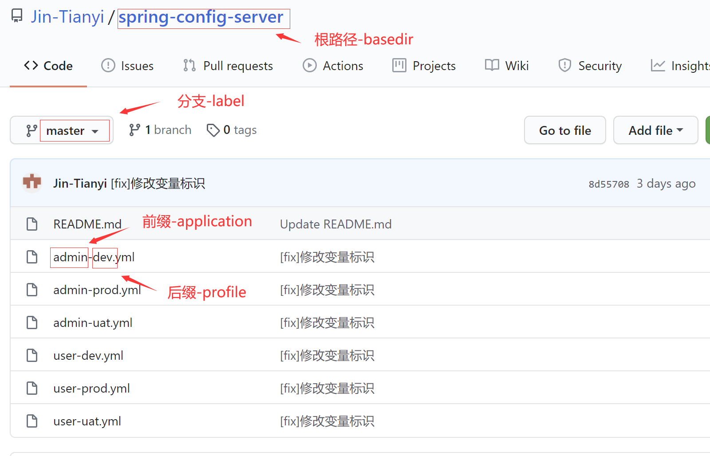
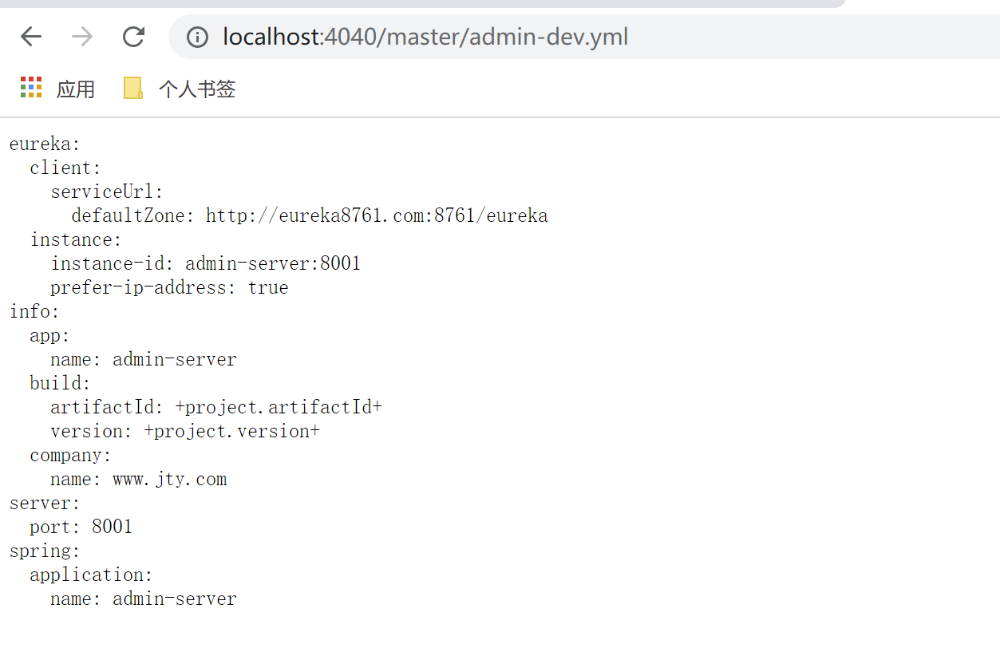
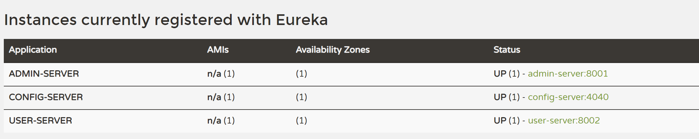
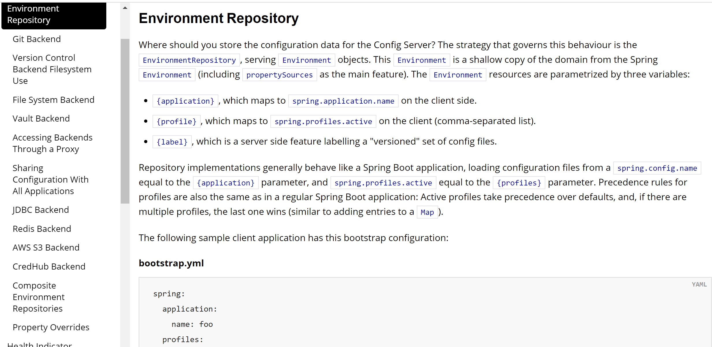
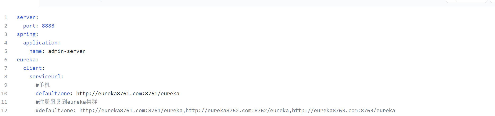
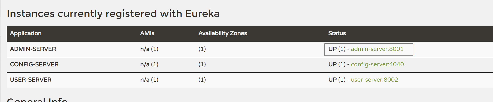
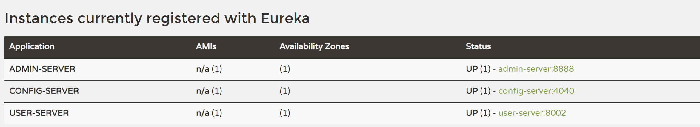
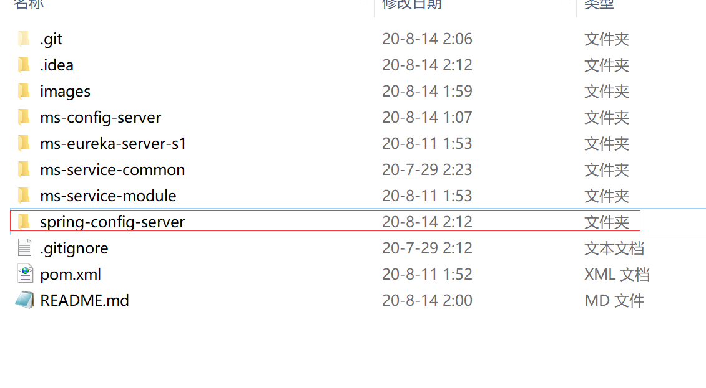

##### SpringCloud Config
对于传统的单体应用，配置文件不是很多，在我们环境发生变化(如数据库迁移、更换服务器、更新配置参数等)，可以手动修改配置文件并重启。
但由于微服务架构每个服务都有自己独立的配置文件，一个一个修改配置文件的方式面临下面问题：
- 服务多、配置文件多，管理起来麻烦(万一记漏了一两个);
- 修改文件时要重新启动服务器，当服务越来越多时，重启应用也是个麻烦的事；
为了方便管理配置文件，SpringCloud将配置文件的管理抽离成单独的服务，配置中心（SpringCloud Config）;

<h5>SpringCloud Config的使用</h5>

<h6>编写配置中心微服务</h6>

`pom.xml`
```
...
<dependencies>
        <dependency>
            <groupId>org.springframework.boot</groupId>
            <artifactId>spring-boot-starter-web</artifactId>
        </dependency>
        <dependency>
            <groupId>org.springframework.boot</groupId>
            <artifactId>spring-boot-starter-actuator</artifactId>
        </dependency>
        <!--Config配置中心服务依赖-->
        <dependency>
            <groupId>org.springframework.cloud</groupId>
            <artifactId>spring-cloud-config-server</artifactId>
        </dependency>
        <!-- eureka 客户端-->
        <dependency>
            <groupId>org.springframework.cloud</groupId>
            <artifactId>spring-cloud-starter-netflix-eureka-client</artifactId>
        </dependency>
    </dependencies>
...
```
`application.yml`
```
server:
  port: 4040

spring:
  application:
    name: config-server

  cloud:
    config:
      server:
        git:
          # git仓库地址
          uri: https://github.com/Jin-Tianyi/spring-config-server.git
          #某个分支下的文件
          label: master
          #根路径
          basedir: spring-config-server
          #搜索路径多个，数组
          search-paths:
            - /*

#注册进eureka server
eureka:
  client:
    serviceUrl:
      #单机
      defaultZone: http://eureka8761.com:8761/eureka
      #注册服务到eureka集群
      #defaultZone: http://eureka8761.com:8761/eureka,http://eureka8762.com:8762/eureka,http://eureka8763.com:8763/eureka
  instance:
    instance-id: ${spring.application.name}:${server.port} #微服务信息提示为服务名：端口,可自定义
    prefer-ip-address: true     #访问路径可以显示IP地址


#微服务信息
info:
  app.name: config-server
  company.name: www.jty.com
  build.artifactId: +project.artifactId+
  build.version: +project.version+
```

`ConfigApp.java`
```
/**
 * @author :jty
 * @date :20-8-11
 * @description :配置中心
 */
@SpringBootApplication
@EnableConfigServer
public class ConfigApp {
    public static void main(String[] args) {
        SpringApplication.run(ConfigApp.class);
    }
}
```

<h6>管理配置配置文件的仓库</h6>

`https://github.com/Jin-Tianyi/spring-config-server.git`


<p>解析规则</p>

```
#label 分支名，application 上图中的配置文件名前缀，profile 文件名后缀（其他微服务通过这几个参数获取配置中心的配置文件）
/{application}/{profile}[/{label}]
/{application}-{profile}.yml
/{label}/{application}-{profile}.yml
/{application}-{profile}.properties
/{label}/{application}-{profile}.properties
```
<p>尝试访问</p>



<h6>其他微服务获取配置文件</h6>

只需导入相应依赖`spring-cloud-starter-config`，配置bootstrap.yml即可。
为了保证配置文件优先加载需使用bootstrap.yml(优先级高，不会被本地其他配置覆盖，可用来加载外部配置)
`bootstrap.yml`
```
spring:
  cloud:
    config:
      #配置中心地址
      uri: http://localhost:4040
      #分支名
      lable: master
      #配置文件前缀名
      name: admin
      #后缀名
      profile: dev
      #配置文件请求路径
      #http://localhost:4040/master/admin0-dev.yml
```
成功启动，服务注册进eurek server


<h5>SpringCloud Config支持多种管理配置文件的方式</h5>

包括文件系统（或本地文件夹）、数据库、svn等，只需按照对应的规则编辑好{application}、{profile}、{label}

https://cloud.spring.io/spring-cloud-config/reference/html/#_spring_cloud_config_server


<h5>手动刷新微服务配置</h5>
上述过程完成后，配置中心修改配置文件，其他微服务需重新启动，该配置才会生效。为了不重新启动其他服务，需对服务进行修改。

- 各个微服务添加依赖`spring-boot-starter-actuator`
- 暴露健康检查端口
```
#所有
management:
  endpoints:
    web:
      exposure:
        include: "*"
```
- 命令行执行
```
curl -X POST "http://localhost:8001/actuator/refresh"
```

测试，将admin服务端口变为8888



修改前

修改后



注：SpringCloud Config会将git仓库缓存到本地

为了防止获取到本地错误文件，可在配置文件中修改强制获取远程文件`force-pull: true`
```
spring:
  cloud:
    config:
      server:
        git:
          uri: https://github.com/spring-cloud-samples/config-repo
          force-pull: true
```
如果您具有多个存储库配置，则可force-pull以为每个存储库配置属性，如以下示例所示：
```
spring:
  cloud:
    config:
      server:
        git:
          uri: https://git/common/config-repo.git
          force-pull: true
          repos:
            team-a:
                pattern: team-a-*
                uri: https://git/team-a/config-repo.git
                force-pull: true
            team-b:
                pattern: team-b-*
                uri: https://git/team-b/config-repo.git
                force-pull: true
            team-c:
                pattern: team-c-*
                uri: https://git/team-a/config-repo.git
```