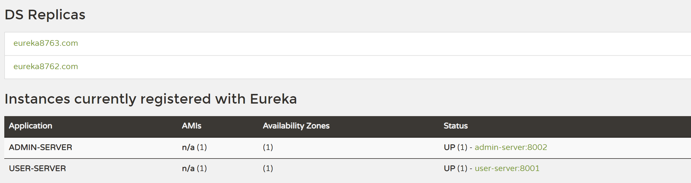
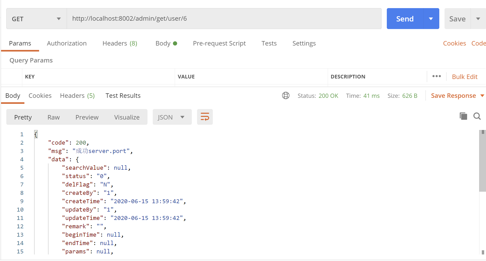
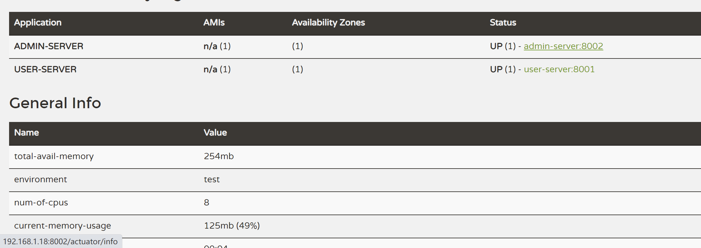
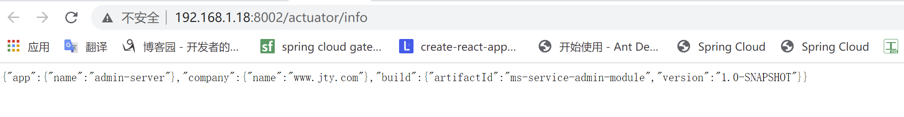

##### springcloud Netflix Eureke
在服务注册与发现中，有一个注册中心，当服务器启动时，会把当前自己的服务器信息，如服务地址通讯地址等以别名的方式注册到注册中心，服务消费者通过别名的方式从注册中心获取实际调用地址；相当于键值对（key:别名、服务名，value:服务器元数据，如地址、端口、请求路径等）；
Eureka采用CS的设计模式，即客户端和服务端Eureka server作为服务端（使用@EnableEurekaServer注解标识），它是服务注册中心而其它微服务作为客户端(使用@EnableEurekaClient标识)注册进Eureka server维持心跳，服务消费者通过RestTemplate（使用@LoadBalanced注解来开启通过微服务名调用，并开启负载均衡）对象调用服务生产者；

<b>Eurka 保证 AP</b>

Eureka Server 各个节点都是平等的，几个节点挂掉不会影响正常节点的工作，剩余的节点依然可以提供注册和查询服务。而 Eureka Client 在向某个 Eureka 注册时，如果发现连接失败，则会自动切换至其它节点。只要有一台 Eureka Server 还在，就能保证注册服务可用(保证可用性)，只不过查到的信息可能不是最新的(不保证强一致性)。
<b>Eurka 集群架构如下</b>

Eureka server通过相互注册来构建集群、Eureka Client通过注册多个同服务名的微服务进所有的Eureka server来构建集群；

<b>Eureka集群配置</b>
```
server:
  port: 8763

eureka:
  instance:
    #hostname: localhost
    hostname: eureka8763.com
  client:
    registerWithEureka: false
    fetchRegistry: false
    serviceUrl:
      #单机
      #defaultZone:http://${eureka.instance.hostname}:${server.port}/eureka/
      #集群
      defaultZone: http://eureka8762.com:8762/eureka,http://eureka8761.com:8761/eureka
```
<b>Eureka Client集群配置</b>
```
spring:
  application:
    name: user-server #多个
eureka:
  client:
    serviceUrl: #注册服务到eureka集群
      defaultZone: http://eureka8761.com:8761/eureka,http://eureka8762.com:8762/eureka,http://eureka8763.com:8763/eureka
```

<b>快速搭建一个Eureka Demo</b>
<b>Eureka Server</b>
`pom.xml`
```
...
 <dependency>
            <groupId>org.springframework.cloud</groupId>
            <artifactId>spring-cloud-starter-netflix-eureka-server</artifactId>
        </dependency>
...
```

`主启动类`
```
@SpringBootApplication
@EnableEurekaServer
public class EurekaServerApp {
    public static void main(String[] args) {
        new SpringApplicationBuilder(EurekaServerApp.class).web(WebApplicationType.SERVLET).run(args);
    }
}
```
`application.yml`
```
server:
  port: 8763 #端口

eureka:
  instance:
    #hostname: localhost  #服务名
    hostname: eureka8763.com  #服务名
  client:
    registerWithEureka: false #不注册自身
    fetchRegistry: false #要不要去注册中心获取其他服务的地址
    serviceUrl:
      #单机
      #defaultZone:http://${eureka.instance.hostname}:${server.port}/eureka/
      #集群
      defaultZone: http://eureka8762.com:8762/eureka,http://eureka8761.com:8761/eureka
```

<b>Eureka Client</b>
<b>消费者</b>
`pom.xml`
```
...
  <!--eureka 客户端-->
        <dependency>
            <groupId>org.springframework.cloud</groupId>
            <artifactId>spring-cloud-starter-netflix-eureka-client</artifactId>
        </dependency>
...
```

`AdminApp.java`
```
/**
 * @author :jty
 * @date :20-6-11
 * @description :eureka服务集群2
 */
@SpringBootApplication
@EnableEurekaClient
public class AdminApp {
    public static void main(String[] args) {
        SpringApplication.run(AdminApp.class);
    }
}
```
`application.yml`
```
server:
  port: 8002
spring:
  application:
    name: admin-server

mybatis:
    ### xml存放路径
  mapper-locations: classpath:mapper/*Mapper.xml

eureka:
  client:
    serviceUrl: #注册服务到eureka集群
      defaultZone: http://eureka8761.com:8761/eureka,http://eureka8762.com:8762/eureka,http://eureka8763.com:8763/eureka
```
`AdminController.java`
```
/**
 * @author :jty
 * @date :20-7-28
 * @description : 管理员模块
 */
@RestController
public class AdminController {
    @Autowired
    RestTemplate restTemplate;
//    private static final String USER_MODULE_URL = "http://localhost:8001";
    private static final String USER_MODULE_URL = "http://user-server";

    @GetMapping(value = "/admin/get/user/{userId}", produces = "application/json;charset=utf-8")
    public Result searchUser(@PathVariable int userId) {
        Result result = restTemplate.getForObject(USER_MODULE_URL + "/get/user/" + userId, Result.class);
        return result;
    }

    @GetMapping(value = "/admin/post/create/user", produces = "application/json;charset=utf-8")
    public Result createUser(@RequestBody User user) {
        Result result = restTemplate.postForObject(USER_MODULE_URL + "/post/create/user", user, Result.class);
        return result;
    }
}
```
`RestTemplateConfig.java`
```
/**
 * @author :jty
 * @date :20-7-28
 * @description :注入RestTemplate Bean
 */
@Configuration
public class RestTemplateConfig {
    /**
     * @LoadBalanced 通过服务名调用，开启负载均衡
     * */
    @Bean
    @LoadBalanced
    public RestTemplate getRestTemplate(){
        return new RestTemplate();
    }
}
```
<b>Eureka Client</b>
<b>服务生产者</b>
`pom.xml`
```
...
  <!--eureka 客户端-->
        <dependency>
            <groupId>org.springframework.cloud</groupId>
            <artifactId>spring-cloud-starter-netflix-eureka-client</artifactId>
        </dependency>
...
```

`UserApp.java`
```
/**
 * @author :jty
 * @date :20-7-20
 * @description :用户模块   @EnableEurekaClient eureka客户端 @EnableDiscoveryClient开启服务发现，获取服务信息
 */
@SpringBootApplication
@EnableEurekaClient
@EnableDiscoveryClient
public class UserApp {
    public static void main(String[] args) {
        new SpringApplicationBuilder(UserApp.class).web(WebApplicationType.SERVLET).run(args);
    }
}
```
`application.yml`
```
server:
  port: 8001
spring:
  application:
    name: user-server #服务名
eureka:
  client:
    serviceUrl: #注册服务到eureka集群
      defaultZone: http://eureka8761.com:8761/eureka,http://eureka8762.com:8762/eureka,http://eureka8763.com:8763/eureka
#数据库配置略
```
`UserController.java`
```
/**
 * @author :jty
 * @date :20-7-20
 * @description :用户模块
 */
@RestController
public class UserController {
    @Autowired
    private UserMapper userMapper;
    @Autowired
    private DiscoveryClient discoveryClient;
    @Value("server.port")
    String serverPort;
    Logger logger = LoggerFactory.getLogger(UserController.class);

    /**
     * 查询用户
     */
    @GetMapping(value = "/get/user/{userId}", produces = "application/json;charset=utf-8")
    public Result searchUser(@PathVariable(value = "userId") int userId) {
        User user = userMapper.getUserById(userId);
        if (user != null) {
            return new Result(200, "成功" + serverPort, user);
        }
        return new Result(-200, "无数据");
    }

    /**
     * 添加用户
     */
    @PostMapping(value = "/post/create/user", produces = "application/json;charset=utf-8")
    public Result createUser(@RequestBody User user) {
        int i = userMapper.createUser(user);
        if (i > 0) {
            return new Result(200, "成功" + serverPort, i);
        }
        return new Result(-200, "插入失败");
    }

    /**
     * 服务发现
     */
    @GetMapping(value = "/get/user/discovery")
    public Object discovery() {
        List<String> services = discoveryClient.getServices();
        List<ServiceInstance> instances = discoveryClient.getInstances("user-server");
        for (String sv : services) {
            logger.info("------------>service{}", sv);
        }
        for (ServiceInstance instance : instances) {
            logger.info("-->{}---{}---{}---{}<--", instance.getInstanceId(), instance.getHost(), instance.getPort(), instance.getUri());
        }
        return instances;
    }
```

<b>测试</b>
<h6>服务监控</h6>



<h6>服务调用</h6>



<b>微服务信息完善</b>
`父工程pom.xml`
```
...
<build>
        <resources>
            <resource>
                <directory>src/main/resources</directory>
                <filtering>true</filtering>
            </resource>
        </resources>
        <plugins>
            <plugin>
                <groupId>org.apache.maven.plugins</groupId>
                <artifactId>maven-resources-plugin</artifactId>
                <configuration>
                    <delimiters>
                        <delimit>@</delimit>
                    </delimiters>
                </configuration>
            </plugin>
        </plugins>
    </build>
...
```
`application.yml`
```
...
eureka:
  client:
    serviceUrl: #注册服务到eureka集群
      defaultZone: http://eureka8761.com:8761/eureka,http://eureka8762.com:8762/eureka,http://eureka8763.com:8763/eureka
  instance:
    instance-id: ${spring.application.name}:${server.port} #微服务信息提示为服务名：端口,可自定义
    prefer-ip-address: true     #访问路径可以显示IP地址

#微服务信息
info:
  app.name: admin-server
  company.name: www.jty.com
  build.artifactId: @project.artifactId@
  build.version: @project.version@
...
```
<h6>提示信息</h6>



<h6>详细信息</h6>


