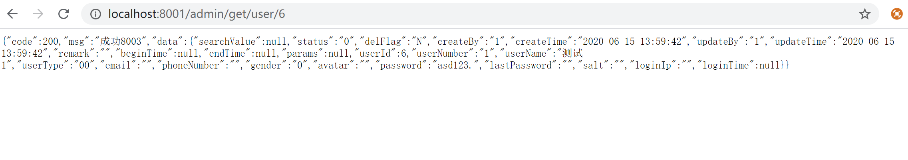
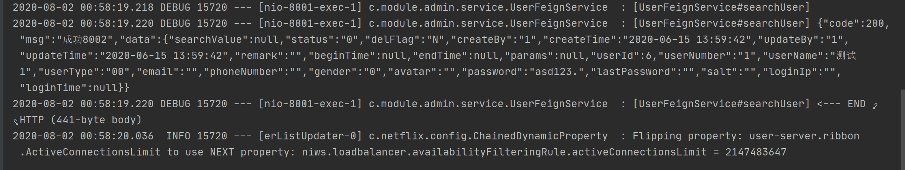

##### OpenFeign
&#160; &#160; &#160; &#160;OpenFeign 是对feign、RestTemplate、Ribbon进行封装的用于代替feign的客户端服务接口调用工具，支持SpringMVC标注注解和HttpMessageConverters，可以与Eureka和Ribbon组合使用以支持负载均衡。Opnefeign的使用非常简单，只需要引入相依依赖，定义service接口绑定目标服务提供的接口即可。

<h5>OpenFeign的使用</h5>

`pom.xml`
```
...
<!-- OpenFeign 服务调用-->
        <dependency>
            <groupId>org.springframework.cloud</groupId>
            <artifactId>spring-cloud-starter-openfeign</artifactId>
        </dependency>
...
```
`AdminApp.java`
```
/**
 * @author :jty
 * @date :20-7-28
 * @description : @EnableFeignClients 开启feign服务调用，默认轮询负载均衡
 */
@SpringBootApplication
@EnableEurekaClient
@EnableFeignClients
public class AdminApp {
    public static void main(String[] args) {
        SpringApplication.run(AdminApp.class);
    }
}
```

<p>定义一个feign 用户服务调用接口，来绑定用户服务的UserController请求</p>

`UserFeignService.java`
```
/**
 * @author :jty
 * @date :20-8-1
 * @description : feign 服务调用接口，@FeignClient(value = "user-server")  value 为目标服务名
 * 方法需要与UserController定义请求方法一致，即UserController请求接口方法中有的SpringMVC注解，本接口一定要有。
 */
@Component
@FeignClient(value = "user-server")
public interface UserFeignService {
    /**
     * 根据用户id查询用户
     * @param userId
     * @return Result
     */
    @GetMapping(value = "/get/user/{userId}", produces = "application/json;charset=utf-8")
    Result searchUser(@PathVariable(value = "userId") int userId);

    /**
     * 新增用户
     * @param user
     * @return Result
     */
    @PostMapping(value = "/post/create/user", produces = "application/json;charset=utf-8")
    Result createUser(@RequestBody User user);
}
```
`AdminController.java`
```
/**
 * @author :jty
 * @date :20-7-28
 * @description : 管理员模块
 */
@RestController
public class AdminController {
    @Autowired
    UserFeignService userFeignService;

    /**
     * RestTemplate forObject
     */
    @GetMapping(value = "/admin/get/user/{userId}", produces = "application/json;charset=utf-8")
    public Result searchUser(@PathVariable int userId) {
        Result result = userFeignService.searchUser(userId);
        return result;
    }

    @GetMapping(value = "/admin/post/create/user", produces = "application/json;charset=utf-8")
    public Result createUser(@RequestBody User user) {
        Result result = userFeignService.createUser(user);
        return result;
    }
}
```


<h5>OpenFeign 服务调用超时处理</h5>

<p>OpenFeign 默认1秒获取不到请求返回结果，则请求超时，在某些场景下需要更改请求超时时间时，须在application.yml中配置</p>

`application.yml`
```
#OpenFeign 默认支持Ribbon
ribbon:
  #指的是建立连接所用的时间，适用于网络状况正常的情况下，两端连接所用的时间
  ReadTimeout: 5000
  #指的是连接后从服务器读取到可用资源所用的时间（默认是1秒）
  ConnectTimeout: 5000
```
<h5>OpenFeign 日志打印</h5>

&#160; &#160; &#160; &#160;OpenFeign提供有日志打印功能，以及不同的日志级别。在开发时跟根据需要调整日志级别来查看请求信息
`FeignLogConfig.java`
```
/**
 * @author :jty
 * @date :20-8-2
 * @description : 配置feign 日志级别
 */
@Configuration
public class FeignLogConfig {
    /**
     * #日志级别
     * #NONE：默认的，不显示任何日志；
     * #BASIC：仅记录请求方法、URL、响应状态码及执行时间；
     * #HEADERS：除了BASIC中定义的信息之外，还有请求和响应的头信息；
     * #FULL：除了HEADERS中定义的信息之外，还有请求和响应的正文及元数据。
     */
    @Bean
    public Logger.Level feignLoggerLevel() {
        return Logger.Level.FULL;
    }
}
```
`application.yml`
```
...
#某个类的日志级别
logging:
  level:
    #feign 日志以什么级别监控哪个接口
    com.module.admin.service.UserFeignService: debug
...
```


