##### Nacos
&#160; &#160; &#160; &#160;Nacos是SpringCloud Alibaba 体系中的服务注册中心和配置中心，帮助发现、配置和管理微服务服务，主要包括服务注册与发现、动态配置以及DNS服务等；详细说明<a href="https://nacos.io/zh-cn/docs/what-is-nacos.html">Nacos</a>

###### 服务发现和服务健康监测
 
1. 下载Nacos <a href="https://github.com/alibaba/nacos/releases">https://github.com/alibaba/nacos/releases</a>
选择windows或Linux下载解压后进入bin目录使用startup.cmd命令启动
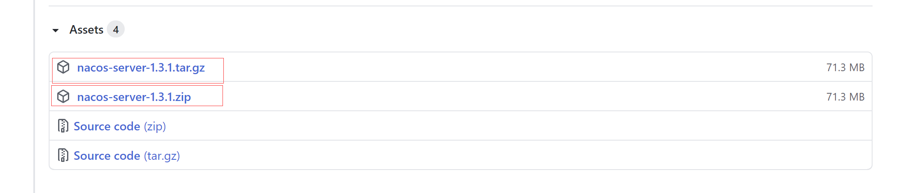
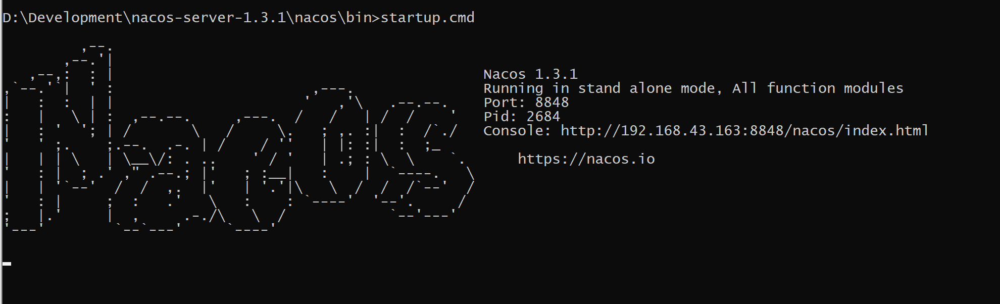
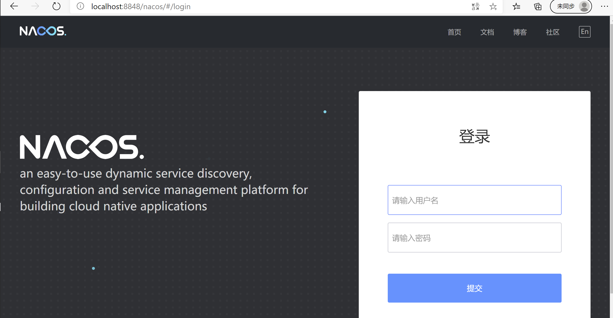
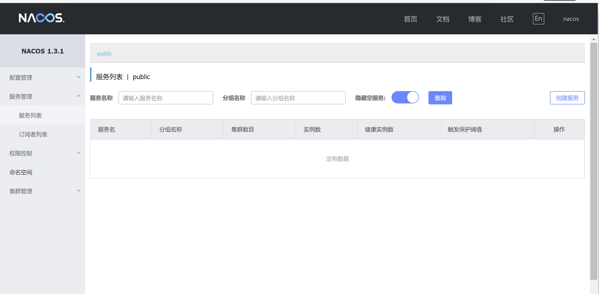

2. 编写服务提供者和消费者，注册进Nacos
`父工程pom.xml`
```
...
 <dependencyManagement>
        <dependencies>
            <dependency>
                <groupId>org.springframework.boot</groupId>
                <artifactId>spring-boot-dependencies</artifactId>
                <version>2.2.5.RELEASE</version>
                <type>pom</type>
                <scope>import</scope>
            </dependency>
            <dependency>
                <groupId>com.alibaba.cloud</groupId>
                <artifactId>spring-cloud-alibaba-dependencies</artifactId>
                <version>2.2.1.RELEASE</version>
                <type>pom</type>
                <scope>import</scope>
            </dependency>
        </dependencies>
    </dependencyManagement>
...
```
`需注册的子模块pom.xml`
```
...
        <dependency>
            <groupId>com.alibaba.cloud</groupId>
            <artifactId>spring-cloud-starter-alibaba-nacos-discovery</artifactId>
        </dependency>
... 
```
##### 管理员模块
`application.yml`
```
server:
  port: 8001
spring:
  application:
    name: admin-server
  #配置nacos服务注册中心地址
  cloud:
    nacos:
      discovery:
        server-addr: 127.0.0.1:8848

#用户模块服务名
provider-service-url:
  user-service: http://user-server

#开启所有端点允许HTTP查看
management:
  endpoints:
    web:
      exposure:
        include: "*"
```
`AdminApp.java`
```
package com.module.admin;

import org.springframework.boot.SpringApplication;
import org.springframework.boot.autoconfigure.SpringBootApplication;
import org.springframework.cloud.client.discovery.EnableDiscoveryClient;
import org.springframework.web.bind.annotation.PathVariable;
import org.springframework.web.bind.annotation.RequestMapping;
import org.springframework.web.bind.annotation.RequestMethod;
import org.springframework.web.bind.annotation.RestController;

/**
 * @author :jty
 * @date :20-7-28
 * @description :管理员模块 Nacos只需要@EnableDiscoveryClient注解即可开启服务注册与发现
 */
@SpringBootApplication
@EnableDiscoveryClient
public class AdminApp {
    public static void main(String[] args) {
        SpringApplication.run(AdminApp.class);
    }
    @RestController
    class EchoController {
        @RequestMapping(value = "/echo/{string}", method = RequestMethod.GET)
        public String echo(@PathVariable String string) {
            return "Hello Nacos Discovery " + string;
        }
    }
}

```
`AdminController.java`
```
package com.module.admin.controller;

import com.base.dao.User;
import com.base.entity.Result;
import org.springframework.beans.factory.annotation.Autowired;
import org.springframework.beans.factory.annotation.Value;
import org.springframework.web.bind.annotation.GetMapping;
import org.springframework.web.bind.annotation.PathVariable;
import org.springframework.web.bind.annotation.RequestBody;
import org.springframework.web.bind.annotation.RestController;
import org.springframework.web.client.RestTemplate;

/**
 * @author :jty
 * @date :20-7-28
 * @description : 管理员模块
 */
@RestController
public class AdminController {
    @Autowired
    RestTemplate restTemplate;
    /** 服务提供者地址 */
    @Value("${provider-service-url.user-service}")
    private String userServiceUrl;

    @GetMapping(value = "/admin/get/user/{userId}", produces = "application/json;charset=utf-8")
    public Result searchUser(@PathVariable int userId) {
        Result result = restTemplate.getForObject(userServiceUrl + "/get/user/" + userId, Result.class);
        return result;
    }

    @GetMapping(value = "/admin/post/create/user", produces = "application/json;charset=utf-8")
    public Result createUser(@RequestBody User user) {
        Result result = restTemplate.postForObject(userServiceUrl + "/post/create/user", user, Result.class);
        return result;
    }
}

```
`RestTemplateConfig.java`
```
package com.module.admin.config;

import org.springframework.cloud.client.loadbalancer.LoadBalanced;
import org.springframework.context.annotation.Bean;
import org.springframework.context.annotation.Configuration;
import org.springframework.web.client.RestTemplate;

/**
 * @author :jty
 * @date :20-7-28
 * @description :注入RestTemplate Bean
 */
@Configuration
public class RestTemplateConfig {
    /**
     * @LoadBalanced 通过服务名调用，开启负载均衡
     * */
    @Bean
    @LoadBalanced
    public RestTemplate getRestTemplate(){
        return new RestTemplate();
    }
}

```

###### 用户模块 
两个用户微服务分别为8002、8003端口
`application.yml`
```
server:
  port: 8002
spring:
#  profiles:
#    active: dev
  application:
    name: user-server
  datasource:
    driver-class-name: com.mysql.cj.jdbc.Driver
    url: jdbc:mysql://localhost:3306/cloud_learn?useUnicode=true&characterEncoding=utf8&useSSL=false&nullCatalogMeansCurrent=true&serverTimezone=Asia/Shanghai&allowPublicKeyRetrieval=true
    username: root
    password: 123456

    initialSize: 2  #最小连接数
    minIdle: 1 #最小空闲
    maxActive: 2o #最大连接数
    maxWait: 60000 #最长等待时间
    timeBetweenEvictionRunsMillis: 60000 #配置间隔多久才进行一次检测，检测需要关闭的空闲连接，单位是毫秒
    #配置一个连接在池中最小生存的时间，单位是毫秒
    minEvictableIdleTimeMillis: 300000
    validationQuery: "select 'x'"
    testWhileIdle: true
    testOnBorrow: false
    testOnReturn: false
    # 打开PSCache，并且指定每个连接上PSCache的大小
    poolPreparedStatements: true
    maxPoolPreparedStatementPerConnectionSize: 20
  #配置nacos服务注册中心地址
  cloud:
    nacos:
      discovery:
        server-addr: 127.0.0.1:8848
mybatis:
    ### xml存放路径
  mapper-locations: classpath:mapper/*Mapper.xml


#开启所有端点允许HTTP查看
management:
  endpoints:
    web:
      exposure:
        include: "*"

```
`UserApp.java`
```
package com.module.user;

import org.springframework.boot.WebApplicationType;
import org.springframework.boot.autoconfigure.SpringBootApplication;
import org.springframework.boot.builder.SpringApplicationBuilder;
import org.springframework.cloud.client.discovery.EnableDiscoveryClient;


/**
 * @author :jty
 * @date :20-7-20
 * @description :用户模块   Nacos只需要@EnableDiscoveryClient注解即可开启服务注册与发现
 */
@SpringBootApplication
@EnableDiscoveryClient
public class UserApp {
    public static void main(String[] args) {
        new SpringApplicationBuilder(UserApp.class).web(WebApplicationType.SERVLET).run(args);
    }
}

```
`UserController.java`
```
package com.module.user.controller;

import com.base.dao.User;
import com.base.entity.Result;
import com.module.user.mapper.UserMapper;
import org.slf4j.Logger;
import org.slf4j.LoggerFactory;
import org.springframework.beans.factory.annotation.Autowired;
import org.springframework.beans.factory.annotation.Value;
import org.springframework.cloud.client.ServiceInstance;
import org.springframework.cloud.client.discovery.DiscoveryClient;
import org.springframework.web.bind.annotation.*;

import java.util.List;


/**
 * @author :jty
 * @date :20-7-20
 * @description :用户模块
 */
@RestController
public class UserController {
    @Autowired
    private UserMapper userMapper;
    @Autowired
    private DiscoveryClient discoveryClient;
    @Value("${server.port}")
    String serverPort;
    Logger logger = LoggerFactory.getLogger(UserController.class);

    /**
     * 查询用户
     */
    @GetMapping(value = "/get/user/{userId}", produces = "application/json;charset=utf-8")
    public Result searchUser(@PathVariable(value = "userId") int userId) {
        User user = userMapper.getUserById(userId);
        if (user != null) {
            return new Result(200, "成功" + serverPort, user);
        }
        return new Result(-200, "无数据");
    }

    /**
     * 添加用户
     */
    @PostMapping(value = "/post/create/user", produces = "application/json;charset=utf-8")
    public Result createUser(@RequestBody User user) {
        int i = userMapper.createUser(user);
        if (i > 0) {
            return new Result(200, "成功" + serverPort, i);
        }
        return new Result(-200, "插入失败");
    }
}

```
启动微服务后查看Nacos服务管理界面
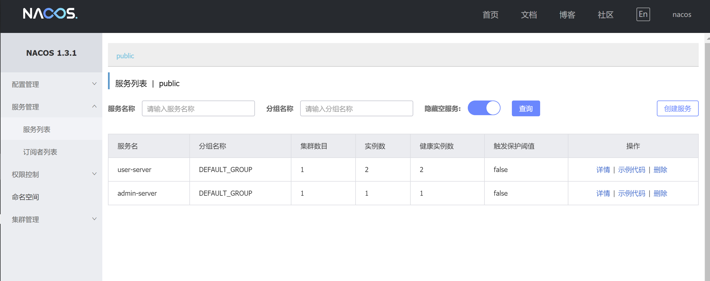
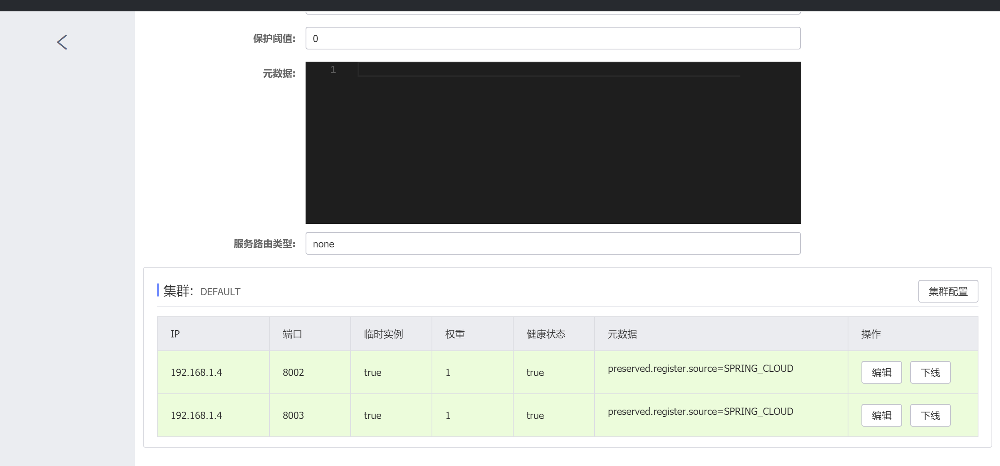


###### 动态配置服务
对8002用户微服务进行动态配置

`pom.xml`添加
```
...

<dependency>
            <groupId>com.alibaba.cloud</groupId>
            <artifactId>spring-cloud-starter-alibaba-nacos-config</artifactId>
        </dependency>
...
```
`UserController.java`
```
package com.module.user.controller;

import com.base.dao.User;
import com.base.entity.Result;
import com.module.user.mapper.UserMapper;
import org.slf4j.Logger;
import org.slf4j.LoggerFactory;
import org.springframework.beans.factory.annotation.Autowired;
import org.springframework.beans.factory.annotation.Value;
import org.springframework.cloud.client.ServiceInstance;
import org.springframework.cloud.client.discovery.DiscoveryClient;
import org.springframework.cloud.context.config.annotation.RefreshScope;
import org.springframework.web.bind.annotation.*;

import java.util.List;


/**
 * @author :jty
 * @date :20-7-20
 * @description :用户模块
 */
@RestController
@RefreshScope
public class UserController {
    @Autowired
    private UserMapper userMapper;
    @Autowired
    private DiscoveryClient discoveryClient;
    @Value("${server.port}")
    String serverPort;
    /** 验证动态配置 */
    @Value("${service.info}")
    String serviceInfo;
    Logger logger = LoggerFactory.getLogger(UserController.class);

    /**
     * 查询用户
     */
    @GetMapping(value = "/get/user/{userId}", produces = "application/json;charset=utf-8")
    public Result searchUser(@PathVariable(value = "userId") int userId) {
        User user = userMapper.getUserById(userId);
        if (user != null) {
            return new Result(200, "成功" + serverPort+":"+serviceInfo, user);
        }
        return new Result(-200, "无数据");
    }

    /**
     * 添加用户
     */
    @PostMapping(value = "/post/create/user", produces = "application/json;charset=utf-8")
    public Result createUser(@RequestBody User user) {
        int i = userMapper.createUser(user);
        if (i > 0) {
            return new Result(200, "成功" + serverPort, i);
        }
        return new Result(-200, "插入失败");
    }
}

```
`bootstrap.yml`
```
server:
  port: 8002
spring:
  application:
    name: user-server
  #配置nacos服务注册中心地址、配置中心地址
  cloud:
    nacos:
      discovery:
        #服务注册中心
        server-addr: 127.0.0.1:8848
        #配置中心
      config:
        server-addr: 127.0.0.1:8848
        prefix: ${spring.application.name}
        #配置文件类型
        file-extension: yaml
        #enableRemoteSyncConfig: true


#配置文件匹配规则 ${prefix}-${spring.profiles.active}.${file-extension} ==》user-server-dev.yaml
#prefix 默认为 spring.application.name 的值，也可以通过配置项 spring.cloud.nacos.config.prefix来配置。
#spring.profiles.active 即为当前环境对应的 profile，详情可以参考 Spring Boot文档。 注意：当 spring.profiles.active 为空时，对应的连接符 - 也将不存在，dataId 的拼接格式变成 ${prefix}.${file-extension}
#file-exetension 为配置内容的数据格式，可以通过配置项 spring.cloud.nacos.config.file-extension 来配置。目前只支持 properties 和 yaml 类型。

```
`application.yml`
```
#可在bootstrap.yml中配置
spring:
  profiles:
    active: dev
```
添加配置
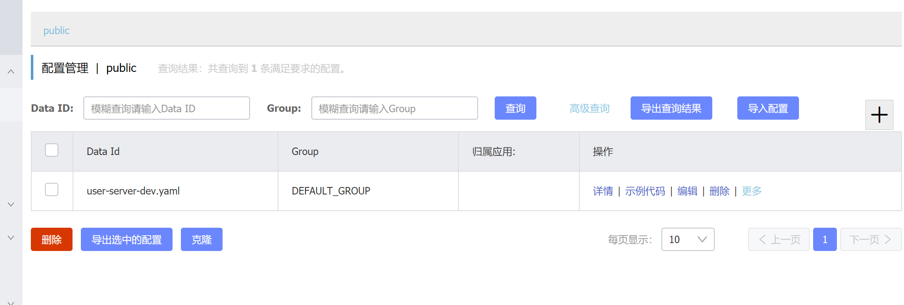
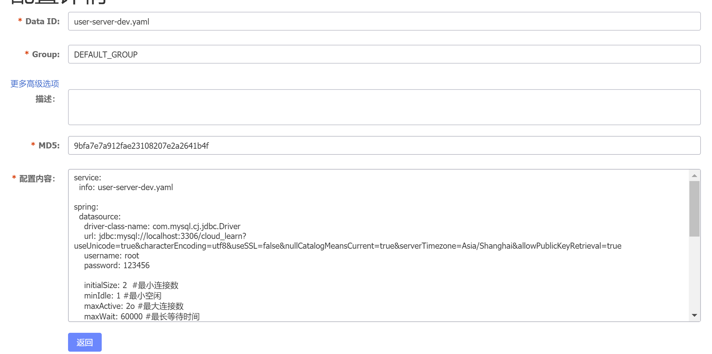
启动服务后请求(初次配置后报错，Could not resolve placeholder 'service.info' in value "${service.info}"，配置中心配置文件不生效，检查各项配置均无问题，最后重启Nacos后正常启动)
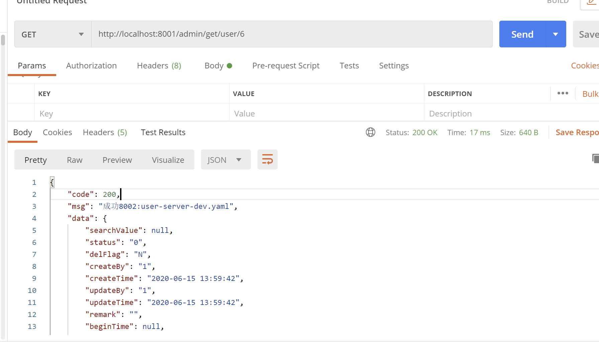
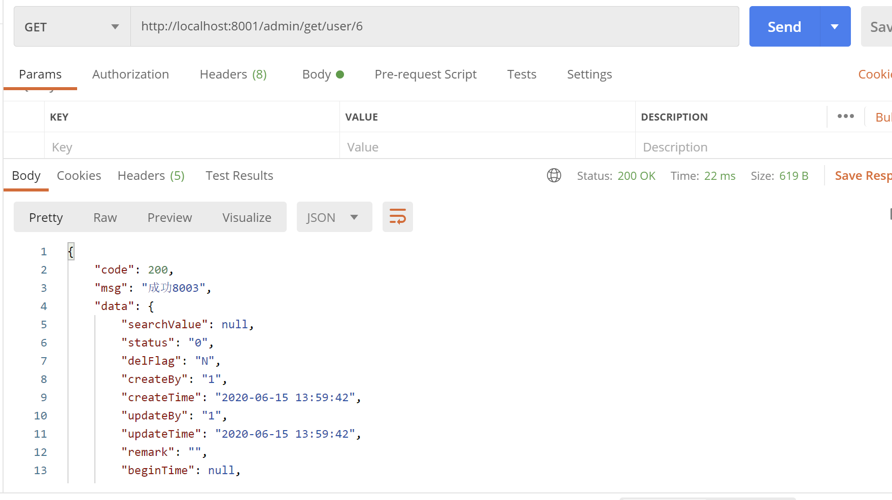
修改配置文件校验动态配置是否生效（编辑后重新发布）
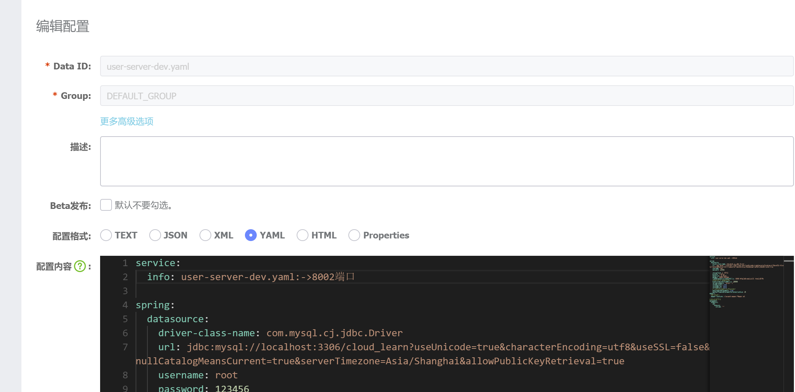


###### 配置参数

配置参数在`com.alibaba.cloud.nacos.NacosConfigProperties`中，其中spring.cloud.nacos.config.group，spring.cloud.nacos.config.fileExtension等有默认值，默认开启动态刷新；
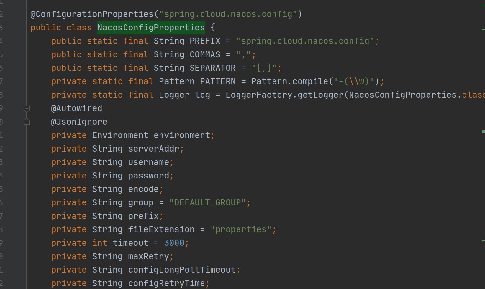

在Nacos中可进行不同粒度的配置，使用默认的namespace和groud只配置dataId(如上述的配置)，则为最小粒度配置，其中还有group和namespace的配置，三个配置粒度从大到小为namespace>group>dataId
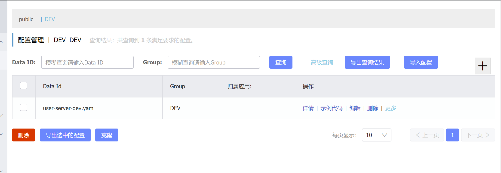
需在配置文件中添加`spring.cloud.nacos.config.group=DEV`和`spring.cloud.nacos.config.namespace=DEV`
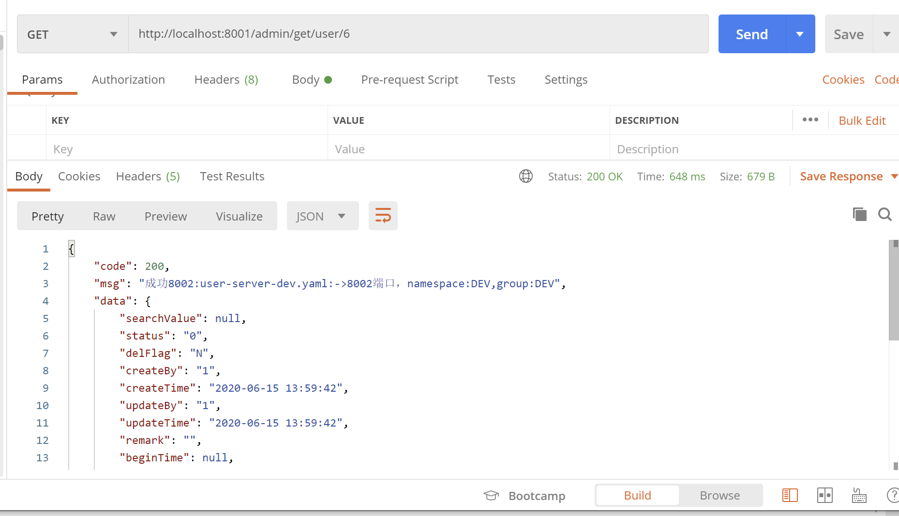


通过服务发现请求user-server服务，可以发现Nacos自带负载均衡。
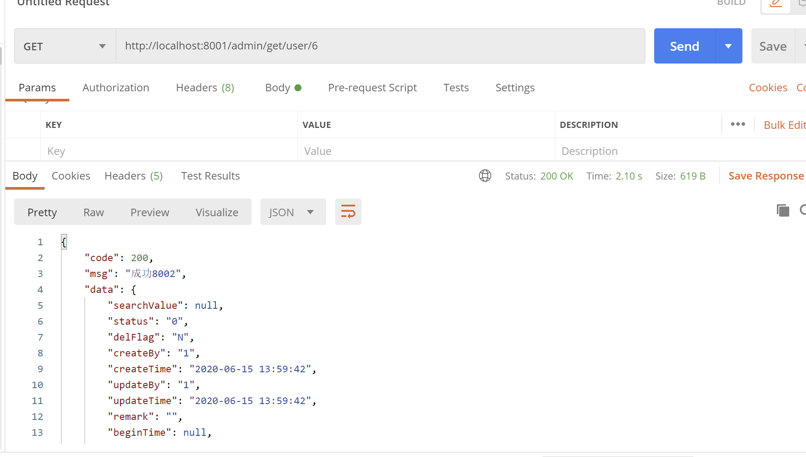
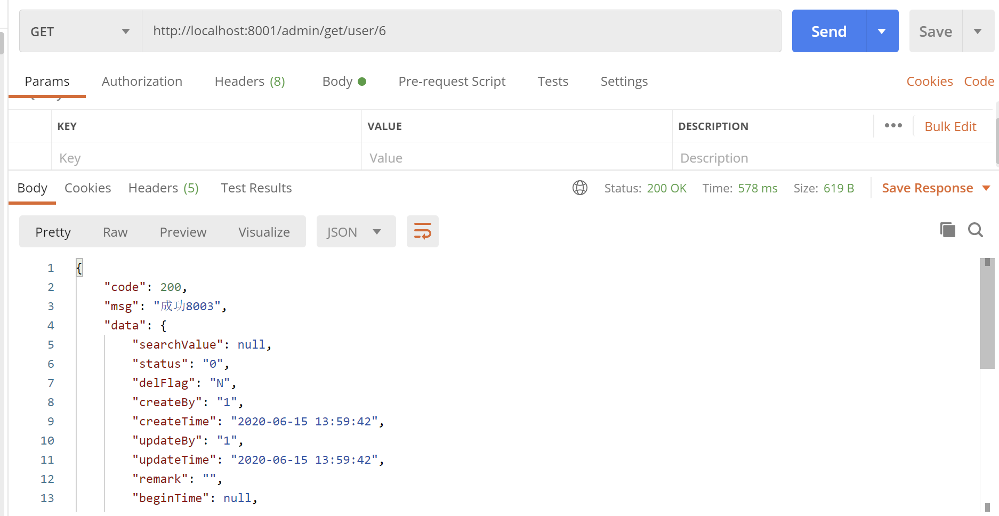
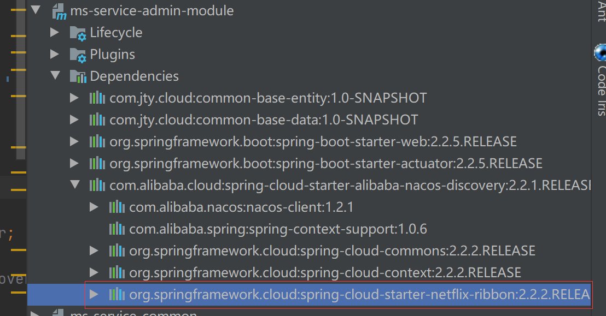


