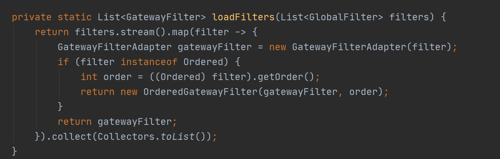

##### 服务网关
<p><b>服务网关 = 路由转发 + 过滤器</b></p>

<p>路由转发:接收一切外界请求，转发到后端的微服务上去</p>
<p>过滤器：对请求进行一系列操作，如请求，权限认证，鉴权，监控，限流，转发等。</p>
服务网关处于应用程序或服务之前，与用户的请求直接打交道（或处于Nginx之后），使用服务网关有如下优点：
- 降低客户端与服务端的耦合度；
- 便于认证，只需要在网关进行认证即可；
- 便于监控，可在网关中监控数据，可以做统一切面任务处理；
- 服务限流、降级等

<h5>SpringCloud Getway</h5>

Spring Cloud Gateway功能：
1. 基于Spring Framework 5，Project Reactor和Spring Boot 2.0构建
2. 能够匹配任何请求属性上的路由。
3. 谓词和过滤器特定于路由。
4. Hystrix断路器集成。
5. Spring Cloud DiscoveryClient集成
6. 易于编写的谓词和过滤器
7. 请求速率限制
8. 路径改写

`pom.xml`
```
...
<dependencies>
        <!--不能引入web starter-->
        <!--gateway 网关依赖,内置webflux 依赖 -->
        <dependency>
            <groupId>org.springframework.cloud</groupId>
            <artifactId>spring-cloud-starter-gateway</artifactId>
        </dependency>
        <!-- eureka 服务发现配置-->
        <dependency>
            <groupId>org.springframework.cloud</groupId>
            <artifactId>spring-cloud-starter-netflix-eureka-client</artifactId>
        </dependency>
        <!--eureka客户端-->
        <dependency>
            <groupId>org.springframework.cloud</groupId>
            <artifactId>spring-cloud-netflix-eureka-client</artifactId>
        </dependency>
    </dependencies>
...
```

`application.yml`
```
server:
  port: 9527

spring:
  application:
    name: getway-server
  cloud:
    gateway:
      discovery:
        locator:
          enabled: true #开启服务发现，可以服务作为转发目标，为 false 时使用地址转发
      routes:
        # 认证中心
        - id: admin-server 
          uri: lb://admin-server #转发后的微服务名 以lb开头
#          uri: http://localhost:8001 #转发后的地址
          predicates:
            - Path=/admin/**   #请求断言，以路径方式以author开头的请求路径转发到uri，官方提供多种断言方式，可结合使用
          filters:
            - StripPrefix=1 #过滤器，对请求进行一系列操作，如请求，权限认证，鉴权，监控，限流，转发等,StripPrefix 去掉一层请求（如去掉admin）
         #最终形式，如https://localhost:9527/admin/admin/get/user/6 =>https://localhost:8001/admin/get/user/6
eureka:
  client:
    serviceUrl:
      #单机
      defaultZone: http://eureka8761.com:8761/eureka
      #注册服务到eureka集群
      #defaultZone: http://eureka8761.com:8761/eureka,http://eureka8762.com:8762/eureka,http://eureka8763.com:8763/eureka
  instance:
    instance-id: ${spring.application.name}:${server.port}
    prefer-ip-address: true     #访问路径可以显示IP地址

#微服务信息
info:
  app.name: getway-server
  company.name: www.jty.com
  build.artifactId: @project.artifactId@
  build.version: @project.version@
```

`GetwayApp.java`
```
/**
 * @author :jty
 * @date :20-7-19
 * @description :服务网关
 */
@EnableDiscoveryClient
@EnableEurekaClient
@SpringBootApplication(exclude = DataSourceAutoConfiguration.class)
public class GetwayApp {
    public static void main(String[] args) {
        SpringApplication.run(GetwayApp.class, args);
    }
}
```
<h6>未使用网关（admin-server微服务请求）</h6>


<h6>使用网关转发（getway转发到admin-server）</h6>


<h5>自定义Filter</h5>

- 执行流程


- 方法：实现GlobalFilter, Ordered两个接口自定义Filter并注入Spring容器即可
- 原理：在自动配置过程中会将所有的全局过滤器以集合的方式放入`FilteringWebHandler`对象中，并适配成GatewayFilter类型，在handle方法中将两种过滤器合并到一起并按照排序。
使用所有实现GlobalFilter接口的实现类的Bean的集合初始化FilteringWebHandler对象(@Bean注解接收的参数自动获取所有基类Bean实现的集合)，getway有9种默认的全局过滤器

使用适配器转换为GatewayFilter类型

合并排序


实现方式一
`SelfFilterConfiguration .java`
```
@Configuration
public class SelfFilterConfiguration {
    private final String MODULE_NAME = SelfFilterConfiguration.class.getName() + ".admin-module";

    /**
     * @Order 注解无效
     */
    @Bean
    @Order(-100)
    public GlobalFilter RewritePathFilter() {
        return (exchange, chain) -> {
            exchange.getAttributes().put(MODULE_NAME, "admin-module");
            return chain.filter(exchange);
        };
    }
}
```
实现方式二
`SelfFilter.java`
```
@Component
public class SelfFilter implements GlobalFilter, Ordered {

    private final String URL_KEY = "getway";
    Logger logger = LoggerFactory.getLogger(SelfFilter.class);

    @Override
    public Mono<Void> filter(ServerWebExchange exchange, GatewayFilterChain chain) {
        ServerHttpResponse response = exchange.getResponse();
        ServerHttpRequest request = exchange.getRequest();
        String path = request.getPath().value();
        if (path == null || !path.contains(URL_KEY)) {
            logger.debug("只允许包含getway的请求通过：{}", path);
            response.setStatusCode(HttpStatus.NOT_FOUND);
            return response.setComplete();
        }
        return chain.filter(exchange);

    }

    @Override
    public int getOrder() {
        //
        return -1;
    }
}
```
优先级：order越小优先级越高，也可发现@Order无效

请求包含getway

不包含

改变`SelfFilter`优先级（后执行）查看`SelfFilterConfiguration`中设置的参数


`application.yml`
```
spring:
  application:
    name: getway-server
  cloud:
    gateway:
      discovery:
        locator:
          enabled: true #开启服务发现，可以服务作为转发目标，为 false 时使用地址转发
      routes:
        # 认证中心
        - id: admin-server
          uri: lb://admin-server #转发后的微服务名 以lb开头
#          uri: http://localhost:8001 #转发后的地址
          predicates:
            #- Path=/admin/**   #请求断言，以路径方式以author开头的请求路径转发到uri，官方提供多种断言方式，可结合使用
            - Path=/**   #所有请求
          filters:
            - StripPrefix=1 #过滤器，对请求进行一系列操作，如请求，权限认证，鉴权，监控，限流，转发等,StripPrefix 去掉一层请求（去掉getway,转发到正确请求路径）
         #最终形式，如https://localhost:9527/admin/get/user/6 =>https://localhost:8001/admin/get/user/6

```