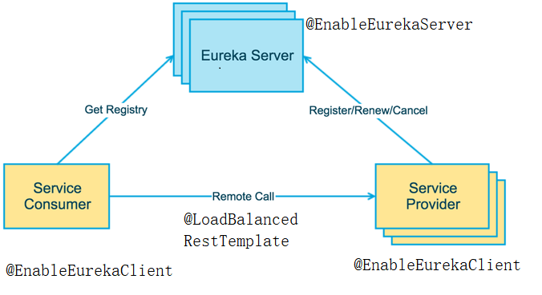

##### springcloud Netflix Eureke
在服务注册与发现中，有一个注册中心，当服务器启动时，会把当前自己的服务器信息，如服务地址通讯地址等以别名的方式注册到注册中心，服务消费者通过别名的方式从注册中心获取实际调用地址；相当于键值对（key:别名、服务名，value:服务器元数据，如地址、端口、请求路径等）；
Eureka采用CS的设计模式，即客户端和服务端Eureka server作为服务端（使用@EnableEurekaServer注解标识），它是服务注册中心而其它微服务作为客户端(使用@EnableEurekaClient标识)注册进Eureka server维持心跳，服务消费者通过RestTemplate（使用@LoadBalanced注解来开启通过微服务名调用，并开启负载均衡）对象调用服务生产者；

<h5>Eurka 保证 AP</h5>

Eureka Server 各个节点都是平等的，几个节点挂掉不会影响正常节点的工作，剩余的节点依然可以提供注册和查询服务。而 Eureka Client 在向某个 Eureka 注册时，如果发现连接失败，则会自动切换至其它节点。只要有一台 Eureka Server 还在，就能保证注册服务可用(保证可用性)，只不过查到的信息可能不是最新的(不保证强一致性)。
<h5>Eureka 集群架构如下</h5>



<p>Eureka server通过相互注册来构建集群、Eureka Client通过注册多个同服务名的微服务进所有的Eureka server来构建集群；</p>

<h5>Eureka集群配置</h5>

```
server:
  port: 8763

eureka:
  instance:
    #hostname: localhost
    hostname: eureka8763.com`
  client:
    registerWithEureka: false
    fetchRegistry: false
    serviceUrl:
      #单机
      #defaultZone:http://${eureka.instance.hostname}:${server.port}/eureka/
      #集群
      defaultZone: http://eureka8762.com:8762/eureka,http://eureka8761.com:8761/eureka
```
<h5>Eureka Client集群配置</h5>

```
spring:
  application:
    name: user-server #多个
eureka:
  client:
    serviceUrl: #注册服务到eureka集群
      defaultZone: http://eureka8761.com:8761/eureka,http://eureka8762.com:8762/eureka,http://eureka8763.com:8763/eureka
```

<h5>快速搭建一个Eureka Demo</h5>

<h5>Eureka Server</h5>

`pom.xml`
```
...
 <dependency>
            <groupId>org.springframework.cloud</groupId>
            <artifactId>spring-cloud-starter-netflix-eureka-server</artifactId>
        </dependency>
...
```

`主启动类`
```
@SpringBootApplication
@EnableEurekaServer
public class EurekaServerApp {
    public static void main(String[] args) {
        new SpringApplicationBuilder(EurekaServerApp.class).web(WebApplicationType.SERVLET).run(args);
    }
}
```
`application.yml`
```
server:
  port: 8763 #端口

eureka:
  instance:
    #hostname: localhost  #服务名
    hostname: eureka8763.com  #服务名
  client:
    registerWithEureka: false #不注册自身
    fetchRegistry: false #要不要去注册中心获取其他服务的地址
    serviceUrl:
      #单机
      #defaultZone:http://${eureka.instance.hostname}:${server.port}/eureka/
      #集群
      defaultZone: http://eureka8762.com:8762/eureka,http://eureka8761.com:8761/eureka
```

<h5>Eureka Client</h5>

<h5>消费者</h5>

`pom.xml`
```
...
  <!--eureka 客户端-->
        <dependency>
            <groupId>org.springframework.cloud</groupId>
            <artifactId>spring-cloud-starter-netflix-eureka-client</artifactId>
        </dependency>
...
```

`AdminApp.java`
```
/**
 * @author :jty
 * @date :20-6-11
 * @description :eureka服务集群2
 */
@SpringBootApplication
@EnableEurekaClient
public class AdminApp {
    public static void main(String[] args) {
        SpringApplication.run(AdminApp.class);
    }
}
```
`application.yml`
```
server:
  port: 8002
spring:
  application:
    name: admin-server

mybatis:
    ### xml存放路径
  mapper-locations: classpath:mapper/*Mapper.xml

eureka:
  client:
    serviceUrl: #注册服务到eureka集群
      defaultZone: http://eureka8761.com:8761/eureka,http://eureka8762.com:8762/eureka,http://eureka8763.com:8763/eureka
```
`AdminController.java`
```
/**
 * @author :jty
 * @date :20-7-28
 * @description : 管理员模块
 */
@RestController
public class AdminController {
    @Autowired
    RestTemplate restTemplate;
//    private static final String USER_MODULE_URL = "http://localhost:8001";
    private static final String USER_MODULE_URL = "http://user-server";

    @GetMapping(value = "/admin/get/user/{userId}", produces = "application/json;charset=utf-8")
    public Result searchUser(@PathVariable int userId) {
        Result result = restTemplate.getForObject(USER_MODULE_URL + "/get/user/" + userId, Result.class);
        return result;
    }

    @GetMapping(value = "/admin/post/create/user", produces = "application/json;charset=utf-8")
    public Result createUser(@RequestBody User user) {
        Result result = restTemplate.postForObject(USER_MODULE_URL + "/post/create/user", user, Result.class);
        return result;
    }
}
```
`RestTemplateConfig.java`
```
/**
 * @author :jty
 * @date :20-7-28
 * @description :注入RestTemplate Bean
 */
@Configuration
public class RestTemplateConfig {
    /**
     * @LoadBalanced 通过服务名调用，开启负载均衡
     * */
    @Bean
    @LoadBalanced
    public RestTemplate getRestTemplate(){
        return new RestTemplate();
    }
}
```
<h5>Eureka Client</h5>

<h5>服务生产者</h5>

`pom.xml`
```
...
  <!--eureka 客户端-->
        <dependency>
            <groupId>org.springframework.cloud</groupId>
            <artifactId>spring-cloud-starter-netflix-eureka-client</artifactId>
        </dependency>
...
```

`UserApp.java`
```
/**
 * @author :jty
 * @date :20-7-20
 * @description :用户模块   @EnableEurekaClient eureka客户端 @EnableDiscoveryClient开启服务发现，获取服务信息
 */
@SpringBootApplication
@EnableEurekaClient
@EnableDiscoveryClient
public class UserApp {
    public static void main(String[] args) {
        new SpringApplicationBuilder(UserApp.class).web(WebApplicationType.SERVLET).run(args);
    }
}
```
`application.yml`
```
server:
  port: 8001
spring:
  application:
    name: user-server #服务名
eureka:
  client:
    serviceUrl: #注册服务到eureka集群
      defaultZone: http://eureka8761.com:8761/eureka,http://eureka8762.com:8762/eureka,http://eureka8763.com:8763/eureka
#数据库配置略
```
`UserController.java`
```
/**
 * @author :jty
 * @date :20-7-20
 * @description :用户模块
 */
@RestController
public class UserController {
    @Autowired
    private UserMapper userMapper;
    @Autowired
    private DiscoveryClient discoveryClient;
    @Value("server.port")
    String serverPort;
    Logger logger = LoggerFactory.getLogger(UserController.class);

    /**
     * 查询用户
     */
    @GetMapping(value = "/get/user/{userId}", produces = "application/json;charset=utf-8")
    public Result searchUser(@PathVariable(value = "userId") int userId) {
        User user = userMapper.getUserById(userId);
        if (user != null) {
            return new Result(200, "成功" + serverPort, user);
        }
        return new Result(-200, "无数据");
    }

    /**
     * 添加用户
     */
    @PostMapping(value = "/post/create/user", produces = "application/json;charset=utf-8")
    public Result createUser(@RequestBody User user) {
        int i = userMapper.createUser(user);
        if (i > 0) {
            return new Result(200, "成功" + serverPort, i);
        }
        return new Result(-200, "插入失败");
    }

    /**
     * 服务发现
     */
    @GetMapping(value = "/get/user/discovery")
    public Object discovery() {
        List<String> services = discoveryClient.getServices();
        List<ServiceInstance> instances = discoveryClient.getInstances("user-server");
        for (String sv : services) {
            logger.info("------------>service{}", sv);
        }
        for (ServiceInstance instance : instances) {
            logger.info("-->{}---{}---{}---{}<--", instance.getInstanceId(), instance.getHost(), instance.getPort(), instance.getUri());
        }
        return instances;
    }
```

<h5>测试</h5>

<h6>服务监控</h6>


<h6>服务调用</h6>


<h5>微服务信息完善</h5>

`父工程pom.xml`
```
...
<build>
        <resources>
            <resource>
                <directory>src/main/resources</directory>
                <filtering>true</filtering>
            </resource>
        </resources>
        <plugins>
            <plugin>
                <groupId>org.apache.maven.plugins</groupId>
                <artifactId>maven-resources-plugin</artifactId>
                <configuration>
                    <delimiters>
                        <delimit>@</delimit>
                    </delimiters>
                </configuration>
            </plugin>
        </plugins>
    </build>
...
```
`application.yml`
```
...
eureka:
  client:
    serviceUrl: #注册服务到eureka集群
      defaultZone: http://eureka8761.com:8761/eureka,http://eureka8762.com:8762/eureka,http://eureka8763.com:8763/eureka
  instance:
    instance-id: ${spring.application.name}:${server.port} #微服务信息提示为服务名：端口,可自定义
    prefer-ip-address: true     #访问路径可以显示IP地址

#微服务信息
info:
  app.name: admin-server
  company.name: www.jty.com
  build.artifactId: @project.artifactId@
  build.version: @project.version@
...
```
<h6>提示信息</h6>


<h6>详细信息</h6>


<h5>Eureka自我保护</h5>

Eureka Server 在运行期间会去统计心跳失败比例在 15 分钟之内是否低于 85%，如果低于 85%（eureka.server.renewal-percent-threshold=0.85），Eureka Server 会将这些实例保护起来，让这些实例不会过期，但是在保护期内如果服务刚好这个服务提供者非正常下线了，此时服务消费者就会拿到一个无效的服务实例，此时会调用失败，对于这个问题需要服务消费者端要有一些容错机制，如重试，断路器等；即一个服务不可用后，Eureka不会立即对其清理，依旧会对微服务的信息进行保存。

<p><b>Erueka server配置相关属性</b></p>

```
#将IP注册到Eureka Server上，如果不配置就是机器的主机名
eureka.instance.prefer-ip-address=true

#设为false，关闭自我保护
eureka.server.enable-self-preservation=false

#表示是否将自己注册到Eureka Server，默认为true
eureka.client.register-with-eureka=false

#表示是否从Eureka Server获取注册信息，默认为true
eureka.client.fetch-registry=false

# 扫描失效服务的间隔时间（单位毫秒，默认是60*1000）即60秒
eureka.server.eviction-interval-timer-in-ms=5000

#设置 eureka server同步失败的等待时间 默认 5分
#在这期间，它不向客户端提供服务注册信息
eureka.server.wait-time-in-ms-when-sync-empty=5

#设置 eureka server同步失败的重试次数 默认为 5 次
eureka.server.number-of-replication-retries=5

#自我保护系数（默认0.85）
eureka.server.renewal-percent-threshold=0.49
```
<h5>Eureka心跳、下线、自我保护</h5>

参考 <a href="https://blog.csdn.net/hry2015/article/details/78245149">https://blog.csdn.net/hry2015/article/details/78245149</a>

<p><b>服务心跳</b></p>

服务实例会通过心跳(eureka.instance.lease-renewal-interval-in-seconds定义心跳的频率，默认值为30s)续约的方式向Eureka Server定时更新自己的状态。Eureka Server收到心跳后，会通知集群里的其它Eureka Server更新此实例的状态。Service Provider/Service Consumer也会定时更新缓存的实例信息。

<p><b>服务下线和剔除</b></p>

服务的下线有两种情况：

在Service Provider服务shutdown的时候，主动通知Eureka Server把自己剔除，从而避免客户端调用已经下线的服务。
Eureka Server会定时（间隔值是eureka.server.eviction-interval-timer-in-ms，默认值为0，默认情况不删除实例）进行检查，如果发现实例在在一定时间（此值由eureka.instance.lease-expiration-duration-in-seconds定义，默认值为90s）内没有收到心跳，则会注销此实例。
这种情况下，Eureka Client的最多需要[eureka.instance.lease-renewal-interval-in-seconds + eureka.client.registry-fetch-interval-seconds]时间才发现服务已经下线。同理，一个新的服务上线后，Eureka Client的服务消费方最多需要相同的时间才发现服务已经上线

服务下线，同时会更新到Eureka Server其他节点和Eureka client的缓存，流程类似同以上的register过程

<p><b>自我保护模式</b></p>
如果Eureka Server最近1分钟收到renew的次数小于阈值（即预期的最小值），则会触发自我保护模式，此时Eureka Server此时会认为这是网络问题，它不会注销任何过期的实例。等到最近收到renew的次数大于阈值后，则Eureka Server退出自我保护模式。

自我保护模式阈值计算：

每个instance的预期心跳数目 = 60/每个instance的心跳间隔秒数
阈值 = 所有注册到服务的instance的数量的预期心跳之和 *自我保护系数
以上的参数都可配置的：

instance的心跳间隔秒数：eureka.instance.lease-renewal-interval-in-seconds
自我保护系数：eureka.server.renewal-percent-threshold
如果我们的实例比较少且是内部网络时，推荐关掉此选项。我们也可以通过eureka.server.enable-self-preservation = false来禁用自我保护系数