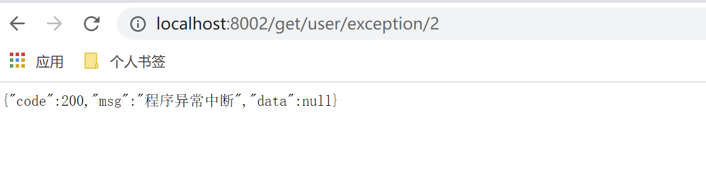

##### Hystrix
&#160; &#160; &#160; &#160;分布式系统中调用服务会遇到的问题，当调用链路过长，某个环节请求出现超时、异常、服务宕机时，会引起整个调用链路出错或者严重占用资源，并且可能蔓延至整个系统，从而引起雪崩效应。
&#160; &#160; &#160; &#160;Hystrix是一个用于处理用于处理分布式系统的延迟和容错的开源框架，当遇到服务调用超时、异常、服务宕机等时，Hystrix能保证向调用方返回一个符合预期的、可处理的备选响应（FallBack），而不是长时间的等待或者抛出调用方法无法处理的异常，这样就保证了服务调用方的线程不会被长时间不必要的占用，降低服务器性能，或导致整体服务失败，可以提高分布式系统的弹性。

<h5>使用Hystrix</h5>

<h5>服务降级FallBack</h5>

&#160; &#160; &#160; &#160;服务降级是当服务器压力剧增的情况下，根据当前业务情况及流量对一些服务和页面有策略的降级，以此释放服务器资源以保证核心任务的正常运行。Hystrix服务降级是针对处理超时或异常的请求做出快速的、可处理响应。如给出友好的提示或返回默认的结果。

服务降级发生场景
 - 程序运行异常
 - 处理超时
 - tomcat或其他服务器容器线程池/信号量打满也会导致服务降级
 - 服务熔断触发服务降级
 
 <h6>通过实现feign 服务调用接口使用Hystrix</h6>
 
 `pom.xml`
 ```
 ...
        <dependency>
             <groupId>org.springframework.cloud</groupId>
             <artifactId>spring-cloud-starter-netflix-hystrix</artifactId>
         </dependency>
 ...
 ```
 
 `application.yml`
 ```
 ...
 #开启feign hystrix 服务降级
 feign:
   hystrix:
     enabled: true
 ...
 ```
 
 `UserFeignService.java`
 ```
 /**
  * @author :jty
  * @date :20-8-1
  * @description : feign 服务调用接口 @FeignClient(value = "user-server")  value 为目标服务名
  * allback = UserFeignServiceHystrixImpl.class Hystrix服务降级方法的实现类
  * 方法需要与UserController定义请求方法一致，即UserController请求接口方法中有的SpringMVC注解，本接口一定要有。
  */
 @Component
 @FeignClient(value = "user-server",fallback = UserFeignServiceHystrixImpl.class)
 public interface UserFeignService {
     /**
      * OpenFeign 超时请求测试
      * @return Result
      */
     @GetMapping(value = "/get/user/timeout")
     Result userServiceTimeOut();
 
     /**
      * 模拟程序异常
      * @return Result
      */
     @GetMapping(value = "/get/user/exception")
     Result userServiceHappenException();
 }
 ```
 
 `UserFeignServiceHystrixImpl.java`
 ```
 /**
  * @author :jty
  * @date :20-8-2
  * @description : 通过实现feign接口使用Hystrix服务降级
  */
 @Component
 public class UserFeignServiceHystrixImpl implements UserFeignService {
     @Override
     public Result userServiceTimeOut() {
         return new Result(-200,UserFeignServiceHystrixImpl.class.getName()+"服务器请求超时或已宕机");
     }
 
     @Override
     public Result userServiceHappenException() {
         return new Result(-200,UserFeignServiceHystrixImpl.class.getName()+"服务器异常或已宕机");
     }
 }
 ```
 
 
 
 <p>优点：代码分离、高重用、可插拔。</p>
 
<h5>服务熔断 break</h5>

&#160; &#160; &#160; &#160;服务熔断的作用类似于我们家用的保险丝，当某服务出现不可用或响应超时的情况时，为了防止整个系统出现雪崩，暂时停止对该服务的调用,是应对雪崩效应的一种微服务链路保护机制。服务正常调用情况下，熔断处于关闭状态（CLOSED），对服务调用不做任何限制。当扇出链路的某个微服务不可用或者响应时间太长时，会进行服务降级，固定时间窗口(一定时间内)内，接口调用出错比例达到一个阈值（Hystrix缺省为5秒20次），会进入熔断开启状态（OPEN）,进而熔断该节点微服务的调用，下次同样的调用直接返回“错误”的响应信息。在进入熔断开启状态一段时间之后（Hystrix默认是5秒），熔断器会进入半熔断状态（HALF-OPEN）,尝试恢复服务调用,并记录调用成功率，当正确请求达到某个指标后恢复调用链路进入熔断关闭状态（CLOSED），服务正常调用，反之将重新进入熔断开启（OPEN），直接返回‘错误’响应。一般对服务调用链中的下游服务做服务熔断以保证上游服务快速得到响应，不阻塞整个系统的运行。

<h6>Hystrix服务熔断</h6>

pom.xml`中引入依赖，主启动类添加`@EnableCircuitBreaker`注释，与上述服务提供方进行服务降级相同。
`UserController.java`
```
/**
 * @author :jty
 * @date :20-7-20
 * @description :用户模块
 */
@RestController
public class UserController {

    private Logger logger = LoggerFactory.getLogger(UserController.class);
    private SimpleDateFormat df = new SimpleDateFormat("yyyy-MM-dd HH:mm:ss");
    private static int index = 0;

    /**
     * OpenFeign 超市请求测试,1.5s超时,自定义处理超时参数
     */
    @GetMapping(value = "/get/user/timeout")
    public Result userServiceTimeOut() {
        try {
            TimeUnit.MILLISECONDS.sleep(3000);
        } catch (InterruptedException e) {
            logger.info(e.getMessage());
        }
        return new Result(200, "三秒后处理结束");
    }

    /**
     * 模拟程序异常 ，服务熔断实例
     */
    @GetMapping(value = "/get/user/exception/{number}")
    @HystrixCommand(fallbackMethod = "userServiceHappenExceptionFb", commandProperties = {
            //开启熔断
            @HystrixProperty(name = "circuitBreaker.enabled", value = "true"),
            //时间窗口请求数量
            @HystrixProperty(name = "circuitBreaker.requestVolumeThreshold", value = "10"),
            //时间窗口持续10s时间
            @HystrixProperty(name = "metrics.rollingStats.timeInMilliseconds", value = "10000"),
            //达到60%错误率后开启熔断器
            @HystrixProperty(name = "circuitBreaker.errorThresholdPercentage", value = "60"),
            //6s后进入半开状态
            @HystrixProperty(name = "circuitBreaker.sleepWindowInMilliseconds", value = "6000")
    })
    public Result userServiceHappenException(@PathVariable(value = "number") int number) {
        logger.info("---------正常执行--------");
        int a = 10 / number;
        Date date = new Date();
        logger.info("请求时间：{},请求序列：{}", df.format(date), index++);
        return new Result(200, "程序正常结束", a);
    }

    public Result userServiceHappenExceptionFb(@PathVariable(value = "number") int number) {
        logger.info("---------执行fallback方法--------");
        Date date = new Date();
        logger.info("请求时间：{},请求序列：{}", df.format(date), index++);
        return new Result(200, "程序异常中断");
    }

}
```
首次正常请求


多次异常请求


再次执行正常请求


一段时间后再次执行正常请求


<p><b>相应参数官方文档</b></p>

<a href="https://github.com/Netflix/Hystrix/wiki/Configuration">https://github.com/Netflix/Hystrix/wiki/Configuration</a>

<p><b>参数类</b></p>

`com/netflix/hystrix/HystrixCommandProperties.class`

<p><b>缺省值</b></p>


<h5>Hystrix仪表盘：服务监控</h5>

新建一个微服务用于监控其它服务

`pom.xml`
```
...
<dependencies>
    <dependency>
        <groupId>org.springframework.boot</groupId>
        <artifactId>spring-boot-starter-web</artifactId>
    </dependency>
    <!--健康检查-->
    <dependency>
        <groupId>org.springframework.boot</groupId>
        <artifactId>spring-boot-starter-actuator</artifactId>
    </dependency>
    <dependency>
        <groupId>org.springframework.cloud</groupId>
        <artifactId>spring-cloud-starter-netflix-hystrix-dashboard</artifactId>
    </dependency>
</dependencies>
...
```
注：被监控的微服务也必须有`spring-boot-starter-actuator`依赖
`application.yml`
```
server:
  port: 10001
```
`HystrixDashboardApp.java`
```
/**
 * @author :jty
 * @date :20-8-5
 * @description :服务监控仪表盘
 */
@SpringBootApplication
@EnableHystrixDashboard
public class HystrixDashboardApp {
    public static void main(String[] args) {
        SpringApplication.run(HystrixDashboardApp.class);
    }

}

```
启动后访问 http://localhost:10001/hystrix


注：被监控微服务有如下要求
 - 有`spring-boot-starter-actuator`依赖
 - 开启熔断器`@EnableCircuitBreaker`
 - 监控流中的地址不能为https请求
 - 若为SpringBoot 2.x以上需手动映射`/actuator/hystrix.stream`
```
 @Bean
    public ServletRegistrationBean getServlet() {
        HystrixMetricsStreamServlet streamServlet = new HystrixMetricsStreamServlet();
        ServletRegistrationBean registrationBean = new ServletRegistrationBean(streamServlet);
        registrationBean.setLoadOnStartup(1);
        registrationBean.addUrlMappings("/actuator/hystrix.stream");
        registrationBean.setName("HystrixMetricsStreamServlet");
        return registrationBean;
    }
```

<p><b>监控localhost:8001如下</b></p>


<p><b>从网上贴来的各个指标含义</b></p>

七色:左边七个颜色的数字分别对应右边七种颜色说明。

Success成功| Short-Circuited短路 | Bad Request请求无效 | Timeout超时 | Rejected拒绝| Failure失败 | Error %错误

一圈:左边实心圆有两种含义，它通过颜色的变化代表了实例的健康程度，它的健康度从绿色<黄色<橙色<红色递减。该实心圆除了颜色的变化之外，它的大小也会根据实例的请求流量发生变化，流量越大该实心圆越大，所以通过实心圆的展示就可以在大量实例中快速的发现故障实例和高压力实例。

一线:用来监控2分钟内流量的相对变化，可以通过它观察到流量的上升和下降趋势。


