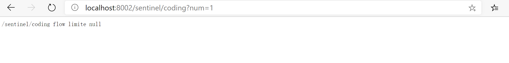

##### Sentinel流量哨兵
Sentinel(流量哨兵)是阿里巴巴版的Histrix，相较于Histrix，Sentinel功能更全面、使用更简便，Sentinel提供现成的控制台（不仅仅监控还可配置）。Sentinel 以流量为切入点，从流量控制、熔断降级、系统负载保护等多个维度保护服务的稳定性。

##### Sentinel使用

###### 硬编码
Sentinel以如下方式进行硬编码
```
 ...
 /** 测试sentinel 硬编码 */
    @GetMapping(value = "/sentinel/coding", produces = "application/json;charset=utf-8")
    public String sentinelConding(@RequestParam(value = "num") int num){
        //规则配置
        initFlowRules();
        while (true) {
            Entry entry = null;
            try {
                // 若需要配置例外项，则传入的参数只支持基本类型
                // EntryType 代表流量类型，其中系统规则只对 IN 类型的埋点生效
                // count 大多数情况都填 1，代表统计为一次调用
                // 热点规则 entry = SphU.entry(resourceName, EntryType.IN, 1, paramA, paramB)
                entry = SphU.entry("/sentinel/coding");
                /*您的业务逻辑 - 开始*/
                logger.info("---------------sentinel 开始---------------");
                int c = 10 / num;
                logger.info("---------------sentinel 结束---------------");
                return "/sentinel/coding success";
                /*您的业务逻辑 - 结束*/
            } catch (BlockException e1) {
                /*流控逻辑处理 - 开始*/
                logger.info("---------------sentinel BlockException-----------");
                return "/sentinel/coding flow limite";
                /*流控逻辑处理 - 结束*/
            } catch (Exception e){
                /* fallback 方法逻辑处理 - 开始*/
                logger.info("---------------sentinel fallback-----------");
                return "/sentinel/coding fallback";
                /* fallback 方法逻辑处理 - 结束*/
            } finally{
                if (entry != null) {
                    //注意：exit 的时候也一定要带上对应的参数，否则可能会有统计错误
                    // entry.exit(1, paramA, paramB)
                    entry.exit();
                }
            }
        }
    }
    /** 规则配置 */
    private void initFlowRules(){
        List<FlowRule> rules = new ArrayList<>();
        //流控规则或其他规则
        FlowRule rule = new FlowRule();
        rule.setResource("/sentinel/coding");
        rule.setGrade(RuleConstant.FLOW_GRADE_QPS);
        // 设置规则参数，如每秒访问3次限流
        rule.setCount(3);
        rules.add(rule);
        FlowRuleManager.loadRules(rules);
    }
...
```
多次测试后发现直接失败时只有第一次限流走`catch (BlockException e1)`,其他直接失败返回`Blocked by Sentinel (flow limiting)`


###### 以下是摘自官网规则配置参数
流控规则参数(FlowRule)
|    Field   |   说明   |  默认值    |
| ---- | ---- | ---- |
|  resource    |   资源名，资源名是限流规则的作用对象   |      |
|  count    |   限流阈值   |      |
|  grade    |   限流阈值类型，QPS 模式（1）或并发线程数模式（0）  |   QPS 模式    |
|  limitApp    |   流控针对的调用来源   |   default，代表不区分调用来源   |
|  strategy    |   调用关系限流策略：直接、链路、关联   |  根据资源本身（直接）    |
|  controlBehavior    |   流控效果（直接拒绝/WarmUp/匀速+排队等待），不支持按调用关系限流   |  直接拒绝    |
|  clusterMode    |   是否集群限流   |  否   |
```
private void initFlowQpsRule() {
    List<FlowRule> rules = new ArrayList<>();
    FlowRule rule = new FlowRule(resourceName);
    // set limit qps to 20
    rule.setCount(20);
    rule.setGrade(RuleConstant.FLOW_GRADE_QPS);
    rule.setLimitApp("default");
    rules.add(rule);
    FlowRuleManager.loadRules(rules);
}
```
降级熔断规则(DegradeRule)
|Field	| 说明 |	默认值 |
| ---- | ---- | ---- |
|resource |	资源名，即规则的作用对象 |	 |
|grade |	熔断策略，支持慢调用比例/异常比例/异常数策略 |	慢调用比例 |
|count |	慢调用比例模式下为慢调用临界 RT（超出该值计为慢调用）；异常比例/异常数模式下为对应的阈值	| |
|timeWindow |	熔断时长，单位为 s	|
|minRequestAmount |	熔断触发的最小请求数，请求数小于该值时即使异常比率超出阈值也不会熔断（1.7.0 引入） |	5 |
|statIntervalMs |	统计时长（单位为 ms），如 60*1000 代表分钟级（1.8.0 引入） |	1000 ms |
|slowRatioThreshold |	慢调用比例阈值，仅慢调用比例模式有效（1.8.0 引入）	| |
同一个资源可以同时有多个降级规则。
```
private void initDegradeRule() {
    List<DegradeRule> rules = new ArrayList<>();
    DegradeRule rule = new DegradeRule();
    rule.setResource(KEY);
    // set threshold RT, 10 ms
    rule.setCount(10);
    rule.setGrade(RuleConstant.DEGRADE_GRADE_RT);
    rule.setTimeWindow(10);
    rules.add(rule);
    DegradeRuleManager.loadRules(rules);
}
```
系统保护规则 (SystemRule)
|Field	| 说明 |	默认值 |
| ---- | ---- | ---- |
|highestSystemLoad |	load1 触发值，用于触发自适应控制阶段 |	-1 (不生效) |
|avgRt |	所有入口流量的平均响应时间 |	-1 (不生效) |
|maxThread |	入口流量的最大并发数 |	-1 (不生效) |
|qps |	所有入口资源的 QPS |	-1 (不生效) |
|highestCpuUsage |	当前系统的 CPU 使用率 （0.0-1.0） | 	-1 (不生效) |
不建议使用
```
private void initSystemRule() {
    List<SystemRule> rules = new ArrayList<>();
    SystemRule rule = new SystemRule();
    rule.setHighestSystemLoad(10);
    rules.add(rule);
    SystemRuleManager.loadRules(rules);
}
```
热点参数规则(ParamFlowRule)
|Field	| 说明 |	默认值 |
| ---- | ---- | ---- |
|resource |	资源名，必填	| |
|count |	限流阈值，必填	 | |
|grade |	限流模式 |	QPS 模式 |
|durationInSec |	统计窗口时间长度（单位为秒），1.6.0 版本开始支持 |	1s |
|controlBehavior |	流控效果（支持快速失败和匀速排队模式），1.6.0 版本开始支持 |	快速失败 |
|maxQueueingTimeMs |	最大排队等待时长（仅在匀速排队模式生效），1.6.0 版本开始支持 |	0ms |
|paramIdx |	热点参数的索引，必填，对应 SphU.entry(xxx, args) 中的参数索引位置	| |
|paramFlowItemList |	参数例外项，可以针对指定的参数值单独设置限流阈值，不受前面 count 阈值的限制。仅支持基本类型和字符串类型 | |	
|clusterMode |	是否是集群参数流控规则 |	false |
|clusterConfig |	集群流控相关配置 | |	

```
private void initSystemRule() {
ParamFlowRule rule = new ParamFlowRule(resourceName)
    .setParamIdx(0)
    .setCount(5);
// 针对 int 类型的参数 PARAM_B，单独设置限流 QPS 阈值为 10，而不是全局的阈值 5.
ParamFlowItem item = new ParamFlowItem().setObject(String.valueOf(PARAM_B))
    .setClassType(int.class.getName())
    .setCount(10);
rule.setParamFlowItemList(Collections.singletonList(item));

ParamFlowRuleManager.loadRules(Collections.singletonList(rule));
}
```
###### 通过控制台配置规则
```
 /** 测试sentinel 控制台配置 */
    @GetMapping(value = "/sentinel/config", produces = "application/json;charset=utf-8")
    public String sentinelConfig(@RequestParam(value = "num") int num){
        int c = 10/num;
        return "/sentinel/config success";
    }
```
<b>配置以请求路径作为默认资源名，否则需要使用@SentinelResource定义资源名，硬编码定义的规则参数，控制台配置上做修改不生效,且控制台配置的规则会消失（如请求其他地址后，或服务重启后），需作持久化</b>


每秒请求次数超过5次后直接返回错误信息


###### 使用注解定义资源
@SentinelResource 用于定义资源，并提供可选的异常处理和 fallback 配置项。 @SentinelResource 注解包含以下属性：
- value：资源名称，必需项（不能为空）
- entryType：entry 类型，可选项（默认为 EntryType.OUT）
- blockHandler / blockHandlerClass: blockHandler 对应处理 BlockException 的函数名称，可选项。blockHandler 函数访问范围需要是 public，返回类型需要与原方法相匹配，参数类型需要和原方法相匹配并且最后加一个额外的参数，类型为 BlockException。blockHandler 函数默认需要和原方法在同一个类中。若希望使用其他类的函数，则可以指定 blockHandlerClass 为对应的类的 Class 对象，注意对应的函数必需为 static 函数，否则无法解析。
- fallback / fallbackClass：fallback 函数名称，可选项，用于在抛出异常的时候提供 fallback 处理逻辑。fallback 函数可以针对所有类型的异常（除了 exceptionsToIgnore 里面排除掉的异常类型）进行处理。fallback 函数签名和位置要求：
  - 返回值类型必须与原函数返回值类型一致；
  - 方法参数列表需要和原函数一致，或者可以额外多一个 Throwable 类型的参数用于接收对应的异常。
  - fallback 函数默认需要和原方法在同一个类中。若希望使用其他类的函数，则可以指定 fallbackClass 为对应的类的 Class 对象，注意对应的函数必需为 static 函数，否则无法解析。
- defaultFallback（since 1.6.0）：默认的 fallback 函数名称，可选项，通常用于通用的 fallback 逻辑（即可以用于很多服务或方法）。默认 fallback 函数可以针对所有类型的异常（除了 exceptionsToIgnore 里面排除掉的异常类型）进行处理。若同时配置了 fallback 和 defaultFallback，则只有 fallback 会生效。defaultFallback 函数签名要求：
  - 返回值类型必须与原函数返回值类型一致；
  - 方法参数列表需要为空，或者可以额外多一个 Throwable 类型的参数用于接收对应的异常。
  - defaultFallback 函数默认需要和原方法在同一个类中。若希望使用其他类的函数，则可以指定 fallbackClass 为对应的类的 Class 对象，注意对应的函数必需为 static 函数，否则无法解析。
- exceptionsToIgnore（since 1.6.0）：用于指定哪些异常被排除掉，不会计入异常统计中，也不会进入 fallback 逻辑中，而是会原样抛出。

```
 /** 测试sentinel 控制台配置 */
    @GetMapping(value = "/sentinel/resource", produces = "application/json;charset=utf-8")
    @SentinelResource(value = "sentinel/resource",blockHandlerClass = UserSentinel.class,blockHandler = "blockHandler",fallback = "fallback")
    public String sentinelResource(@RequestParam(value = "num") int num){
        logger.info("---------------sentinel 开始---------------");
        int c = 10/num;
        logger.info("---------------sentinel 结束---------------");
        return "/sentinel/resource success";
    }
```
`UserSentinel.java`
```
public class UserSentinel {
    public static String blockHandler(int num, BlockException e){
        return "/sentinel/resource blockHandler";
    }
    public static String fallback(int num){
        return "/sentinel/resource fallback";
    }
}
```


以上测试均需先启动nacos和sentinel控制台

##### 支持feign服务调用
`pom.xml`
```
...
       <dependency>
            <groupId>org.springframework.cloud</groupId>
            <artifactId>spring-cloud-starter-openfeign</artifactId>
            <version>2.2.2.RELEASE</version>
        </dependency>
...
```
`application.yml`
```
#开启支持feign
feign:
  sentinel:
    enabled: true
```
<b>主启动类添加`@EnableFeignClients`</b>

`UserService.java`
```
/**
 * @author :jty
 * @date :20-9-9
 * @description :feign远程调用接口
 */
@Component
@FeignClient(value = "user-server", fallback = UserServiceImpl.class)
public interface UserService {
    /**
     * 查询用户
     * @param userId
     * @return Result
     */
    @GetMapping(value = "/get/user/{userId}", produces = "application/json;charset=utf-8")
    Result searchUser(@PathVariable(value = "userId") int userId);
    /**
     * 添加用户
     * @param user
     * @return Result
     */
    @PostMapping(value = "/post/create/user", produces = "application/json;charset=utf-8")
    Result createUser(@RequestBody User user) ;
}
```
`UserServiceImpl.java`
```
/**
 * @author :jty
 * @date :20-9-9
 * @description : 服务降级熔断实现
 */
@Component
public class UserServiceImpl implements UserService {
    /**
     * 查询用户
     * @param userId
     * @return Result
     */
    @Override
    @GetMapping(value = "/get/user/{userId}", produces = "application/json;charset=utf-8")
    public Result searchUser(@PathVariable(value = "userId") int userId) {
        return new Result(-200, "服务降级或熔断",null);
    }
    /**
     * 添加用户
     * @param user
     * @return Result
     */
    @Override
    @PostMapping(value = "/post/create/user", produces = "application/json;charset=utf-8")
    public Result createUser(@RequestBody User user) {
        return new Result(-200, "服务降级或熔断",null);
    }
}
```
`UserSentinel.java`
```
/**
 * @author :jty
 * @date :20-9-9
 * @description : sentinel 服务降级、熔断方法实现
 */
public class UserSentinel {
    public static Result blockHandler(int userId, BlockException e){
        return new Result(-200, "sentinel 服务降级或熔断",null);
    }
    public static Result fallback(int userId, BlockException e){
        return new Result(-200, "sentinel 服务降级或熔断",null);
    }
}
```

`AdminController.java`
```
/**
 * @author :jty
 * @date :20-7-28
 * @description : 管理员模块
 */
@RestController
public class AdminController {
    @Autowired
    private RestTemplate restTemplate;
    /** 服务提供者地址 */
    @Value("${provider-service-url.user-service}")
    private String userServiceUrl;
    @Resource
    private UserService userService;

    /** feign 调用，feign 服务降级和熔断*/
    @GetMapping(value = "/admin/find/user/{userId}", produces = "application/json;charset=utf-8")
    public Result searchUser(@PathVariable int userId) {
        Result result = userService.searchUser(userId);
        return result;
    }
    /** restTemplate 调用，sentinel 服务降级和熔断 */
    @GetMapping(value = "/admin/get/user/{userId}", produces = "application/json;charset=utf-8")
    @SentinelResource(value = "/admin/get/user/", blockHandler = "blockHandler",
            blockHandlerClass = UserSentinel.class, fallback = "fallback")
    public Result getUser(@PathVariable int userId) {
        int c = 10/0;
        Result result = restTemplate.getForObject(userServiceUrl + "/get/user/" + userId, Result.class);
        return result;
    }
    @GetMapping(value = "/admin/post/create/user", produces = "application/json;charset=utf-8")
    @SentinelResource(value = "/admin/post/create/user", blockHandler = "blockHandler",
            blockHandlerClass = UserSentinel.class, fallback = "fallback")
    public Result createUser(@RequestBody User user) {
        Result result = userService.createUser(user);
        return result;
    }
}
```
`RestTemplateConfig.java`
```
/**
 * @author :jty
 * @date :20-7-28
 * @description :注入RestTemplate Bean
 */
@Configuration
public class RestTemplateConfig {
    /**
     * @LoadBalanced 通过服务名调用，开启负载均衡
     * */
    @Bean
    @LoadBalanced
    public RestTemplate getRestTemplate(){
        return new RestTemplate();
    }
}
```

sentinel异常熔断


用户服务user-server关闭，feign调用


去掉异常后sentinel

用户服务user-server关闭


##### sentinel配置持久化（Nacos）
`pom.xml`
```
...
      <dependency>
            <groupId>com.alibaba.csp</groupId>
            <artifactId>sentinel-datasource-nacos</artifactId>
      </dependency>
...
```
`application.yml`
```
...
spring:
  cloud:
    sentinel:
      datasource:
        ds1:
          nacos:
            server-addr: 127.0.0.1:8848
            data-id: ${spring.application.name}-flow
            group-id: DEFAULT_GROUP
            data-type: json
            rule-type: s
        ds2:
          nacos:
            # nacos地址
            server-addr: 127.0.0.1:8848
            # 配置文件名称
            data-id: ${spring.application.name}-degrade
            # 分组
            group-id: DEFAULT_GROUP
            # 数据格式
            data-type: json
            # 规则类型 com/alibaba/cloud/sentinel/datasource/RuleType.class 定义的枚举类型
            rule-type: degrade
...
```
配置参数在各规则参数中查询


